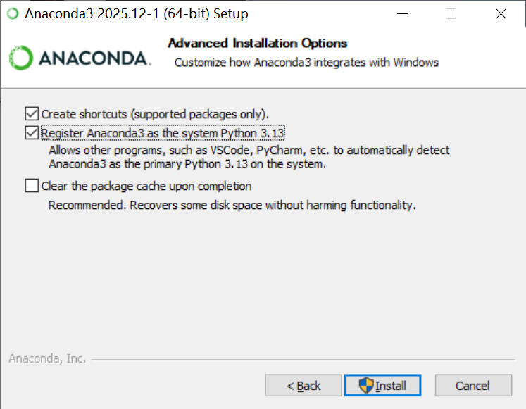
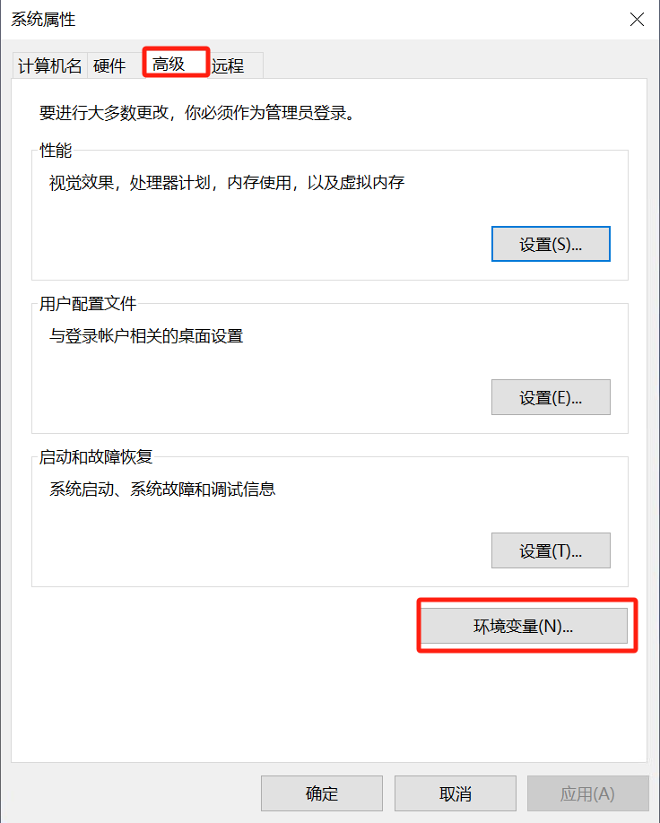
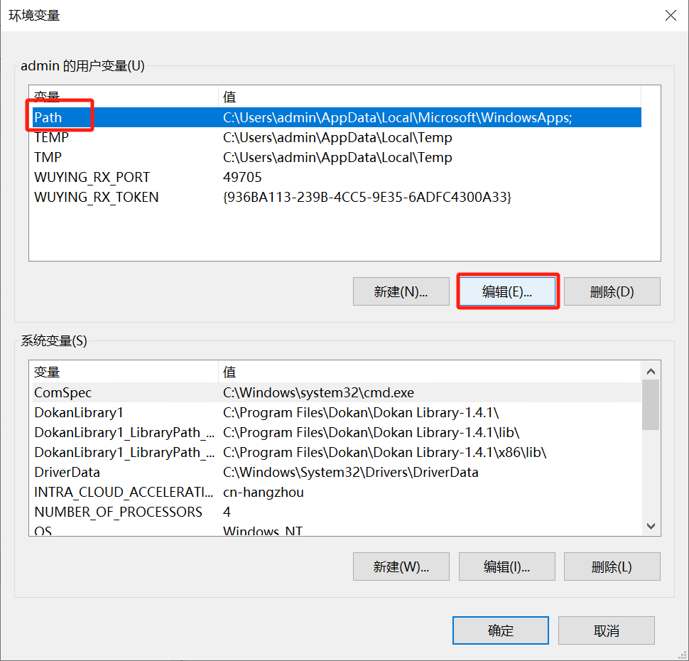
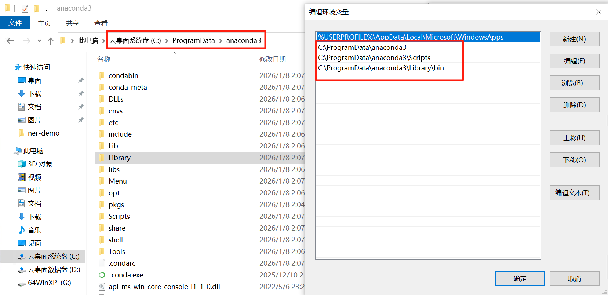

# 第二节 环境准备

## 一、安装 Anaconda

### 1.1 Anaconda 简介

**Anaconda** 是一个面向数据科学和机器学习场景的 Python 发行版，由 Anaconda, Inc. 维护。一套安装包中同时包含 Python 解释器、常用科学计算库（如 `NumPy`、`Pandas`、`Matplotlib` 等）以及功能强大的包和环境管理工具 **conda**，可以为不同项目创建彼此隔离的虚拟环境，提供在 Windows / macOS / Linux 上基本一致的命令行体验，并支持通过 Anaconda Navigator（图形界面）或终端中的 `conda` 命令方便地安装、升级和卸载第三方库。

> 如果已经比较熟悉 `pyenv`、`venv` 或 `uv` 等其他环境管理工具，也可以继续使用。

### 1.2 下载 Anaconda 安装包

（1）打开浏览器，访问 Anaconda 官方下载页面 [https://www.anaconda.com/download/success](https://www.anaconda.com/download/success)。如图 1-2 可以看到，官网提供了 **Anaconda Distribution** 和 **Miniconda** 两种下载选项。**Anaconda Distribution** 预装了 Python、Conda 以及 1500+ 个常用的数据科学包和图形界面工具，适合初学者或希望开箱即用的用户，优点是一次安装即可满足大部分需求，但安装包体积较大（1 GB左右）。而 **Miniconda** 仅包含 Python 和 Conda 包管理器，是一个最小化的安装包，适合高级用户或对磁盘空间敏感的用户，优点是轻量级且安装迅速，但初始状态下不包含科学计算库，需手动安装。

> 如果是第一次接触 Python 数据科学环境，建议选择 **Anaconda Distribution**，可以省去很多配置麻烦。

<p align="center">
  
  <br />
  <em>图 1-2 Anaconda 官网下载页</em>
</p>

（2）图 1-2 中同样还可以看到三个系统的选项，**Windows**、**macOS**、**Linux**。根据自己设备的操作系统和芯片架构选择对应版本即可。

### 1.3 Windows 安装流程

（1）双击下载好的 `Anaconda3-x.x.x-Windows-x86_64.exe`，点击 `Next`。

<p align="center">
  
  <br />
  <em>图 1-3 Anaconda 安装向导</em>
</p>

（2）在安装向导中：
    
- **License Agreement**：勾选同意协议，点击 `Next`。
- **Installation Type**：默认 `All Users`。
- **Choose Install Location**：推荐自行指定一个全英文路径（例如 `D:\Anaconda3`），不建议使用默认 C 盘。
> 不要把 Anaconda 安装在带有中文或空格的路径下，例如 `C:\Program Files` 或带中文用户名的目录，容易导致后续路径解析问题。
- **Advanced Options**：建议勾选 `Register Anaconda3 as default Python`。

<p align="center">
  
  <br />
  <em>图 1-4 Anaconda 高级安装选项</em>
</p>

（3）点击 `Install` 等待安装完成后，点击 `Finish` 结束安装。安装完成后，在开始菜单中就能看到 `Anaconda Prompt`（命令行终端）和 `Anaconda Navigator`（图形管理界面）。

（4）按 `Win+R` 打开运行对话框，输入 `sysdm.cpl` 并回车。如图 1-5 切换到高级选项卡，点击环境变量按钮。

<p align="center">
  
  <br />
  <em>图 1-5 Windows 系统环境变量配置</em>
</p>

（5）如图 1-6 选择用户变量中的 `Path`，点击编辑。

<p align="center">
  
  <br />
  <em>图 1-6 编辑环境变量</em>
</p>

（6）点击新建，添加以下路径（根据前面自己设置的安装路径修改）：

- X:\xxx\anaconda3
- X:\xxx\anaconda3\Scripts
- X:\xxx\anaconda3\Library\bin

如图 1-7 就是笔者根据自己设置的目录添加的对应路径。

<p align="center">
  
  <br />
  <em>图 1-7 添加 Path 路径</em>
</p>

（7）设置完成后点击确定退出这三个界面，注意不要直接关闭。接着打开命令行窗口输入 `conda --version`，如果出现如下输出说明配置成功了。

```bash
conda 25.11.0
```

### 1.4 macOS / Linux 安装流程（简要）

（1）推荐在 macOS / Linux 上使用 **Miniconda** 脚本方式安装，这样更轻量。以常见的 x86_64 Linux 为例，可以在终端中执行：

```bash
wget https://repo.anaconda.com/miniconda/Miniconda3-latest-Linux-x86_64.sh -O ~/miniconda.sh
bash ~/miniconda.sh
```

（2）根据安装脚本提示完成安装：

- 按 Enter 阅读许可协议；
- 输入 `yes` 同意协议；
- 在提示安装路径时直接按 Enter 使用默认路径（如 `/home/用户名/miniconda3`）或自行指定一个无空格、无中文的路径；
- 询问是否初始化 Miniconda 时，输入 `yes`，让安装程序自动为当前 shell 配置 `conda` 环境。

（3）安装结束后，重新打开一个终端窗口，或在当前终端中执行：

```bash
source ~/.bashrc    # macOS 如果默认使用 zsh，可以执行 source ~/.zshrc
conda --version
```

若能正确显示 `conda` 版本号，说明 Miniconda 已在 macOS / Linux 上安装成功。

## 二、配置 Conda 国内镜像（可选但推荐）

默认情况下，`conda` 从官方源下载软件包，在国内网络环境下可能比较慢。可以使用清华镜像源加速。

在终端（或 Anaconda Prompt）中依次执行：

```bash
conda config --add channels https://mirrors.tuna.tsinghua.edu.cn/anaconda/pkgs/main/
conda config --add channels https://mirrors.tuna.tsinghua.edu.cn/anaconda/pkgs/r/
conda config --add channels https://mirrors.tuna.tsinghua.edu.cn/anaconda/pkgs/msys2/
conda config --set show_channel_urls yes
```

执行后可以通过以下命令检查当前配置的源：

```bash
conda config --show channels
```

如果后续遇到软件包冲突或安装失败，也可以根据提示临时切回官方源再重试。

## 三、创建 base-llm 专用虚拟环境

为了避免与其他项目互相影响，强烈建议为本项目单独创建一个 `base-llm` 环境。

（1）在终端中运行：

```bash
conda create -n base-llm python=3.10
```

- `base-llm`：环境名称，可以根据喜好修改。
- `python=3.10`：本项目推荐使用 Python 3.10 版本。

出现提示时输入 `y` 回车，等待环境创建完成。

（2）可以通过以下命令激活环境：

```bash
conda activate base-llm
```

激活成功后，命令行前缀会出现 `(base-llm)`，表示当前所有 `python` / `pip` / `conda` 操作都在此环境中进行。若要退出该环境，可使用：

```bash
conda deactivate
```

## 四、在环境中安装常用依赖

（1）首先在终端中确保已激活环境：

```bash
conda activate base-llm
```

（2）激活 `base-llm` 环境后，可以先安装一些常用的第三方库，这些库涵盖了大部分数据处理与可视化需求。

```bash
pip install numpy pandas matplotlib scikit-learn jupyter -y
```

（3）本项目的代码主要基于 PyTorch，如果当前设备只有 CPU，可以使用下面命令直接安装：
    
```bash
pip install torch torchvision torchaudio -y
```

（4）如果设备中有 GPU，并希望使用 CUDA，通过 `nvcc --version` 查看完 cuda 版本后可以参考 [PyTorch 官网](https://pytorch.org/get-started/locally/)的安装指令，选择与设备和显卡驱动匹配的 CUDA 版本。
