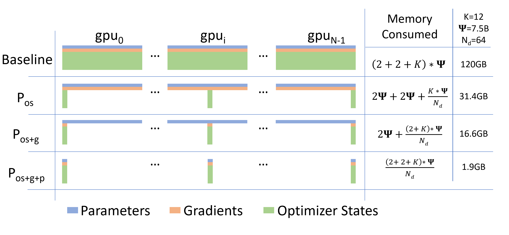
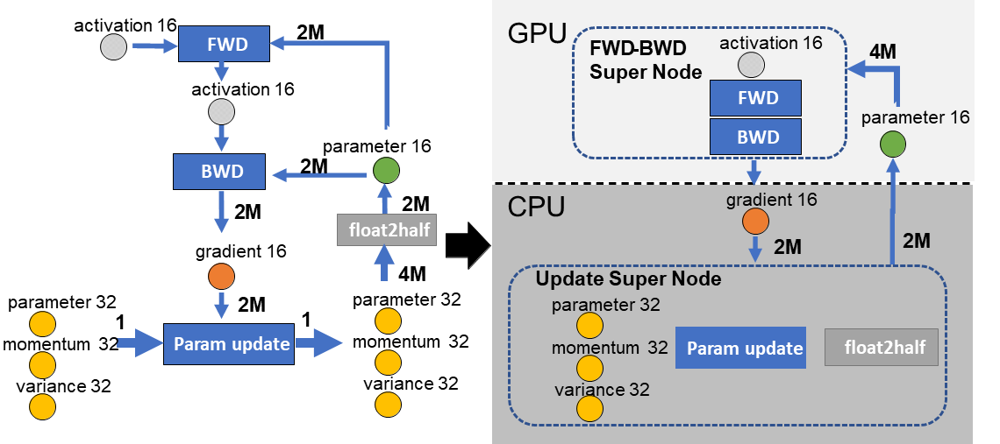
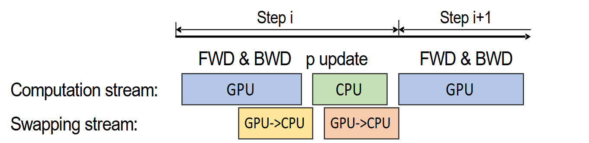
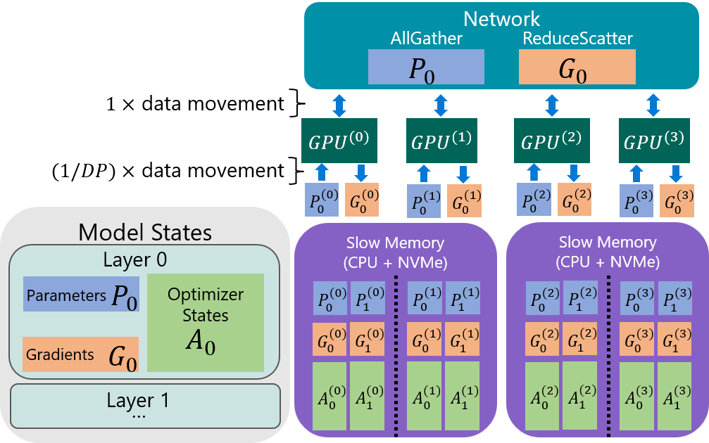
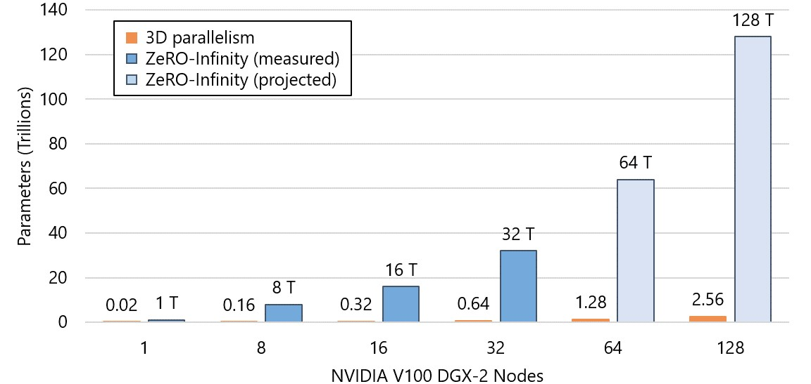

## 第二节 DeepSpeed 分布式训练框架

## 一、DeepSpeed 全家桶一览

### 1.1 DeepSpeed 概述
 
我们在前面已经通过 QLoRA、PEFT、RLHF 等技术，体验了在**单机单卡**甚至消费级显卡上完成大模型微调的可能性。但如果目标从“微调一个 7B 模型”升级为**从零预训练、全量微调甚至训练万亿参数模型**，仅靠量化与 LoRA 显然还不够，此时就需要引入微软开源的 **PyTorch 分布式训练与推理优化库 [DeepSpeed](https://www.deepspeed.ai/)**。它的目标是让开发者在相同硬件条件下**用更少的显存训练更大的模型**、**训练更快、扩展更稳**，并提供从训练到推理的一整套工程化组件。它与 Hugging Face 的关系可以简单理解为 **Hugging Face** 更偏向“模型与数据”的生态（`transformers`、`datasets` 等），而 **DeepSpeed** 更偏向“系统与算力”的生态（显存优化、并行策略、通信调度等）。

  
   
  <em>图 13-7 DeepSpeed 官方文档 Getting Started 页面</em>

在微软的官方介绍中，DeepSpeed 的主要子模块包括：

- **DeepSpeed Training**：本节的主角，包含 ZeRO、Offload、Infinity、3D 并行等训练技术；
- **DeepSpeed Inference / Compression**：针对推理和压缩（量化、剪枝、KV Cache 优化等）的加速库；
- **DeepSpeed-MoE**：面向 MoE 大模型的高效路由与通信实现；
- **DeepSpeed-Chat / RLHF**：支持大规模 RLHF、DeepSpeed-Chat 等对话模型训练；
- **DeepSpeed for Science**：将这些系统能力扩展到科学计算场景。

日常工作中，最常见的两个使用场景是当我们想在**单机多卡或多机多卡**环境下进行预训练或全量微调大模型时，通常会重点使用 **DeepSpeed Training + ZeRO**。而当我们需要在服务器上部署一个高吞吐的推理服务时，则会更多地结合 **DeepSpeed Inference 与各类量化/压缩技术**一起使用。

### 1.2 DeepSpeed Training 要解决的三大挑战

DeepSpeed Training 希望解决的是这样一个组合问题。一是**显存不够**，单张 GPU 就算有 80GB 显存，也远远放不下万亿参数的模型训练所需状态（权重、梯度、优化器状态、激活值）；二是**加速比不理想**，单纯堆 GPU 数量，在数据并行下很快就会遇到通信瓶颈，难以获得接近线性的加速；三是**硬件异构**，现实集群中同时存在 GPU 显存、CPU 内存、NVMe SSD 甚至远程存储，如何让这些异构资源一起“干活”，而不是让昂贵的 GPU 无限空等。围绕这三个问题，DeepSpeed 提出了以 **ZeRO（Zero Redundancy Optimizer）** 为核心的一系列技术（ZeRO、ZeRO-Offload、ZeRO-Infinity），再叠加数据并行、模型并行、流水线并行构成完整的 3D 并行框架。

## 二、显存开销与 ZeRO 系列内存优化
 
前面我们已经学会了如何估算**推理阶段**的显存开销，知道“只加载权重并做前向传播”大概需要多少显存。这里我们换一个视角，聚焦在**训练相对于推理多出来的那一部分显存**。相比只做推理或只训练极少量 LoRA 参数的 QLoRA 微调，全量预训练或全量微调需要为每一个参数额外维护梯度和优化器状态，而这正是 ZeRO 要重点优化的部分。为了更直观地理解这一点，我们先以一个 7B 模型为例，看看在不做任何内存优化时，全量训练大致需要多少显存。
 
### 2.1 Qwen2.5-7B 全量训练需要多少显存？

假设我们想要对一个 7B 模型（约 70 亿参数）进行全量预训练或微调，并采用常见的 Adam 优化器和混合精度训练策略。

（1）**模型权重**

- 存储精度：通常采用 **FP16/BF16（2 Bytes）**；
- 显存占用：

$$
\text{Param} \approx 7 \times 10^{9} \times 2\ \text{Bytes} \approx 14\ \text{GB} \tag{13.11}
$$

（2）**梯度**

- 反向传播中同样以 16-bit 精度存储；
- 显存占用与参数同量级：

$$
\text{Grad} \approx 14\ \text{GB} \tag{13.12}
$$

（3）**优化器状态——以 Adam 为例**

- 在优化器内部，一般会将参数提升为 **FP32（4 Bytes）** 精度来计算更新；
- 对每个参数，Adam 至少需要存储：
  - 一个 FP32 精度的参数拷贝（Master Weights）；
  - 一阶动量 $m$；
  - 二阶动量 $v$。
- 每个状态都是 4 Bytes，因此单参数的优化器状态一共约 **12 Bytes**：

$$
K_{\text{Adam}} = 4\ (\text{master}) + 4\ (m) + 4\ (v) = 12\ \text{Bytes} \tag{13.13}
$$

- 对于 7B 参数模型：

$$
\text{OptStates} \approx 7 \times 10^{9} \times 12\ \text{Bytes} \approx 84\ \text{GB} \tag{13.14}
$$

（4）**总显存开销（不含激活与碎片）**

把上述三部分加起来：

$$
\text{Mem}_{\text{states}} \approx (14 + 14 + 84)\ \text{GB} = 112\ \text{GB} \tag{13.15}
$$

再考虑到中间激活、临时张量、显存碎片等，实际训练中的峰值显存往往会来到 **120GB 甚至更高**。很多资料中常见的结论，一个 7B 模型如果想**全量训练**，大概需要 120GB 显存，就是由这一组估算推导出来的。

为了便于后续讨论，可以把“每个参数对应的字节数”抽象写成：

$$
\underbrace{2}_{\text{参数}} + \underbrace{2}_{\text{梯度}} + \underbrace{12}_{\text{优化器}} = 16\ \text{Bytes/Param} \tag{13.16}
$$

也就是说，在**经典数据并行 + Adam** 的设定下，**每个可训练参数平均需要约 16 Bytes 显存**（不含激活）。这就是 DeepSpeed 想要“动刀”的地方。**如果我们能把这 16 Bytes 中的冗余复制部分打散分摊到多张卡上，每张卡就不需要承担完整的 16 Bytes 开销**，从而在固定总 GPU 数量下训练更大的模型。

### 2.2 Zero Redundancy Optimizer 的分治思路

回到刚才的结论，在**经典数据并行 + Adam** 的设定下，每个参数都会对应一整套模型状态。在 **Data Parallel（数据并行）** 中，会用 $N$ 张 GPU，每张 GPU 上都存一份**完整的模型状态副本**，每次训练时由不同 GPU 处理不同的数据子集（batch 切分），计算结束后再通过 `all-reduce` 汇总梯度并统一更新参数。这样一来，那一整套模型状态会在每张卡上各复制一份，总共变成 $N$ 份，这部分跨设备的重复存储就是所谓的“冗余”。ZeRO 的名字 **“Zero Redundancy Optimizer”** 正是针对这一痛点而来 [^1]，它的核心思路是将这些冗余的模型状态在不同 GPU 之间**分片（Shard）**，从“人人持有一整份”变成“大家一起拼一份”，从而降低单卡显存压力。

> **All-Reduce（全归约）的内部拆解**
>
> 标准的 `All-Reduce` 操作（让每张卡都得到梯度的总和/平均）通常由两步完成：
> - **Reduce-Scatter（分散归约）**：大家手里都有一部分数据（如梯度），先将不同部分归约（求和/平均）到不同的 GPU 上。结果是每张 GPU 只握有一部分归约后的完整结果。
> - **All-Gather（全局收集）**：大家手里都有一部分数据（如参数分片），通过广播互换，最终每张 GPU 都收集到了所有人的数据，拼成了一份完整的数据副本。

#### 2.2.1 ZeRO 的三个 Stage 在分谁？

ZeRO 将显存优化分为三个递进的阶段，关键是逐步把**优化器状态（Optimizer States）**、**梯度（Gradients）** 和 **模型参数（Parameters）** 从“每卡完整复制”变为“多卡分片存储”。

在经典数据并行下，每张 GPU 需要维护：

$$
\text{Mem}_{\text{DP}} \propto OS + G + P \tag{13.17}
$$

其中，$\text{Mem}_{\text{DP}}$ 表示在经典数据并行（Data Parallel, DP）设定下**单张 GPU 上用于存储模型状态的显存开销**，而 $OS$、$G$、$P$ 分别代表优化器状态、梯度和参数，这里只关注它们的相对规模，所以用“$\propto$”表示与这三部分之和成正比。

这个过程中 ZeRO 分别在三个 Stage 中逐步把这三类状态打散到多张 GPU 上：

（1）**ZeRO-1（Optimizer States Sharding）**

在这一阶段，ZeRO **仅对优化器状态（OS）进行分片**，而参数（P）与梯度（G）仍然在每张 GPU 上完整保存。此时，单卡显存开销近似变为：

$$
\text{Mem}_{\text{ZeRO-1}} \propto P + G + \frac{OS}{DP} \tag{13.18}
$$

相当于大家依然各自持有完整的模型和梯度，但优化器状态（如 Adam 的动量）被切分了，每张卡只负责维护其中一小块。由于优化器状态在总显存中占比往往最大（约 75%），仅这一步就能带来显著的显存节省。这也是为什么在当前的大模型训练实践中，ZeRO-1 往往被视为“最低配置”或默认开启的基线功能。

（2）**ZeRO-2（OS + G 分片）**

在 ZeRO-1 的基础上，ZeRO-2 进一步对**梯度**进行了分片，此时只有参数仍完整复制在每张卡上。单卡显存进一步降低为：

$$
\text{Mem}_{\text{ZeRO-2}} \propto P + \frac{G}{DP} + \frac{OS}{DP} \tag{13.19}
$$

这通常能带来约 8～16 倍的显存节省（视 DP 并行度而定），使得单卡能训练更大的模型。

（3）**ZeRO-3（OS + G + P 全分片）**

这是“火力全开”的终极形态，对**模型参数**本身也进行了分片。此时每张 GPU 只保存整个模型参数的一部分，单卡显存变为：

$$
\text{Mem}_{\text{ZeRO-3}} \propto \frac{P}{DP} + \frac{G}{DP} + \frac{OS}{DP} \tag{13.20}
$$

理论上，随着 GPU 数量的增加，单卡显存占用可以被压缩到原来的 $1/DP$ 量级，这就是训练万亿参数模型的关键所在。

如图 13-8 展示了 Baseline 与 ZeRO 三个阶段在显存占用上的对比。随着 ZeRO 阶段的深入，单卡显存占用（绿色代表优化器状态，橙色代表梯度，蓝色代表参数）被逐步“削减”和分摊。

  
   
  <em>图 13-8 ZeRO 各阶段显存占用对比图</em>

如果把之前说的 “16 Bytes/Param” 的分解代入（其中 `OS = 12 Bytes`，`G = 2 Bytes`，`P = 2 Bytes`），可以用一个更直观的形式表示：

$$
\text{Bytes/Param} \approx
\begin{cases}
2 + 2 + 12, & \text{Baseline 数据并行}\\
2 + 2 + \dfrac{12}{DP}, & \text{ZeRO-1}\\[4pt]
2 + \dfrac{2}{DP} + \dfrac{12}{DP}, & \text{ZeRO-2}\\[4pt]
\dfrac{2}{DP} + \dfrac{2}{DP} + \dfrac{12}{DP}, & \text{ZeRO-3}
\end{cases} \tag{13.21}
$$

> 当 `DP=64` 时，ZeRO-3 能将每参数平均显存从 16 Bytes 压缩到约 $16/64 \approx 0.25$ Bytes 量级（不含激活与碎片），这就是论文中在 64 张 V100 上用 16GB 单卡显存训练**万亿参数模型**的底层逻辑。

为了更直观地感受这三个阶段的威力，我们可以参考 ZeRO 论文中的实测数据（表 13-2）。表中展示了不同参数规模的模型，在不同 GPU 数量下，开启 ZeRO 各阶段后的单卡显存占用（单位：GB）：

<table border="1" style="margin: 0 auto;">
<tr>
  <td style="text-align: center;"><strong>DP (GPUs)</strong></td>
  <td style="text-align: center;"><strong>7.5B 模型 (ZeRO-1 / 2 / 3)</strong></td>
  <td style="text-align: center;"><strong>128B 模型 (ZeRO-1 / 2 / 3)</strong></td>
  <td style="text-align: center;"><strong>1T 模型 (ZeRO-1 / 2 / 3)</strong></td>
</tr>
<tr>
  <td style="text-align: center;"><strong>1</strong></td>
  <td style="text-align: center;">120 / 120 / 120</td>
  <td style="text-align: center;">2048 / 2048 / 2048</td>
  <td style="text-align: center;">16TB / 16TB / 16TB</td>
</tr>
<tr>
  <td style="text-align: center;"><strong>64</strong></td>
  <td style="text-align: center;">31.4 / 16.6 / <strong>1.9</strong></td>
  <td style="text-align: center;">536 / 284 / <strong>32</strong></td>
  <td style="text-align: center;">4.2TB / 2.2TB / 250</td>
</tr>
<tr>
  <td style="text-align: center;"><strong>1024</strong></td>
  <td style="text-align: center;">30.1 / 15.1 / <strong>0.1</strong></td>
  <td style="text-align: center;">513 / 257 / <strong>2</strong></td>
  <td style="text-align: center;">4TB / 2TB / <strong>15.6</strong></td>
</tr>
</table>

<em>表 13-2 不同模型规模与并行度下的 ZeRO 单卡显存占用对比 (单位: GB)</em>

能够看到如果不使用 ZeRO（相当于第一行 DP=1 的情况），训练一个 1T 参数模型需要单卡 **16TB** 显存，这在现有硬件上是不可能的。但如果开启 **ZeRO-3** 并在 **1024 张 GPU** 上并行（最后一行最右侧），单卡显存仅需 **15.6 GB**！这意味着用现有的 16GB/32GB 显卡集群就可以训练万亿参数模型。

#### 2.2.2 通信开销与“线性加速比”的平衡

在分片带来显存红利的同时，也会引入额外的通信开销。ZeRO 论文中对通信量（Communication Volume）进行了详细分析（假设模型参数量为 $\Psi$）：

- **ZeRO-1 / ZeRO-2**：通信量为 **$2\Psi$**，与标准数据并行同阶。直观理解是把标准 DP 的 `all-reduce` 用 `reduce-scatter + all-gather` 这类等价组合来实现后，总通信量量级不变，但通信“形态”发生了变化（例如 ZeRO-2 需要配合分片优化器在 step 内做参数分片的聚合/同步）。
- **ZeRO-3**：通信量为 **$3\Psi$**，约为标准数据并行的 **1.5 倍**。这是因为在前向/反向传播中需要为计算临时聚合当前层所需参数分片（可理解为额外的参数 `all-gather`），再叠加梯度的 `reduce-scatter` 与更新后参数的同步通信。虽然通信量上升，但换来的是**参数级别的全分片**，使得单卡显存占用能随 GPU 数量近似按 $1/DP$ 下降。

总的来说，ZeRO 系列论文和 DeepSpeed 的工程实现，核心就是在**显存开销、通信带宽与计算时间**三者之间找到一个工程上可接受、又足够通用的平衡点。由于 ZeRO 节省了大量显存，往往允许使用**更大的 Batch Size**，可以显著提升计算的算术强度，在部分场景下甚至能观察到**超线性加速（Super-linear Speedup）**的效果。

### 2.3 ZeRO-R

在实践中，即使把参数、梯度和优化器状态都进行了分片优化，训练过程中的显存峰值仍然可能被其他因素“偷走”。例如，中间激活值的缓存、反向传播中临时张量的创建与释放、显存碎片（Fragmentation）导致的不可用空间，以及不均匀的 layer 配置导致的部分 GPU 负载不均，都可能成为新的显存瓶颈。

为此，论文中提出了一个补充模块 **ZeRO-R**，主要从三个维度进一步优化显存使用：

- **分区激活检查点（Partitioned Activation Checkpointing, $P_a$）**
  - 结合 Activation Checkpointing，但在模型并行（MP）中，ZeRO 进一步删除了激活值的复制冗余；
  - 仅保留分片的激活检查点，需要时通过 `all-gather` 重建。这使得激活显存随 MP 并行度线性降低。
- **恒定大小缓冲区（Constant Size Buffers）**
  - 将很多临时张量的分配重定向到一个或少数几个可复用的大型 buffer 中；
  - 避免频繁的小块分配与释放造成的显存碎片。
- **显存碎片整理（Memory Defragmentation）**
  - 对显存中的可用区域做更加智能的分配策略；
  - 在长时间训练过程中保持可用显存的有效比例。

这些优化看起来只是“工程小技巧”，却往往决定了：**你是刚好能跑起来，还是训练到一半 OOM 崩溃**。

### 2.4 ZeRO-Offload

#### 2.4.1 为什么需要 Offload？

前面的 ZeRO 假设所有模型状态（无论是否分片）都存放在 GPU 显存中。但在许多现实环境下，GPU 显存资源往往非常有限（比如每卡仅 16GB～24GB），而 CPU 内存则相对“富裕”（几十 GB 甚至上百 GB）。如果能把一部分状态“搬”到 CPU 内存上，哪怕训练速度稍慢一点，也能让普通用户“有机会”训练参数量大得多的模型。

**ZeRO-Offload** 的思路是把一部分原本需要占用 GPU 显存的模型状态（最典型的是 **FP32 master weights 与优化器状态**，以及在某些配置下的梯度缓冲区），卸载（Offload）到 CPU 内存上，由 CPU 负责更新；GPU 侧则尽可能聚焦前向/反向的计算 [^2]。论文从训练数据流与通信量角度分析了这种“**GPU 计算前向/反向 + CPU 计算参数更新**”划分在多种约束下的合理性。图 13-9 展示了其核心架构：GPU 负责计算密集型的前向与反向传播（FWD-BWD Super Node），CPU 负责显存密集型的参数更新（Update Super Node）。图中 `M` 表示模型参数量，对应箭头上的 `2M/4M` 可理解为**一次 step 内在 CPU 与 GPU 之间需要交换的数据量级**（常见的拆解是：梯度约 `2M`（FP16），参数回传约 `2M`（FP16），合计约 `4M`；而 FP32 master 与优化器状态主要驻留在 CPU 内存中）。

  
   
  <em>图 13-9 ZeRO-Offload 数据流与计算划分示意图</em>

#### 2.4.2 单机单卡下的典型数据流与优化

在单卡 + ZeRO-Offload 的设定下，一次训练 step 的简化流程大致如下：

（1）**GPU 上前反向传播，必要时将梯度/分片梯度 Offload 到 CPU**：

GPU 上保留用于计算的 FP16/BF16 参数副本，完成前向计算得到激活与 loss，并进行反向传播得到梯度。随后根据配置（例如是否做梯度分片、是否将梯度缓冲转移到 CPU），通过 PCIe/NVLink 将梯度（或梯度分片）拷贝到 CPU 内存，以释放 GPU 显存压力并为 CPU 侧更新做准备。

（2）**CPU 上执行优化器更新（更新 FP32 master 与优化器状态）**：

CPU 内存中保存着 FP32 精度的 master weights 以及 Adam 的 $m$、$v$ 等状态。CPU 利用刚刚拷贝来的梯度更新这些状态，得到新的参数值（此时仍在 CPU 端）。为了降低 CPU 侧优化器成为瓶颈的风险，ZeRO-Offload 会采用高度优化的 CPU Adam 实现（例如利用 SIMD 指令与多线程并行）。同时，为了进一步掩盖 CPU 计算与 CPU↔GPU 交换的延迟，论文还提出了**单步延迟更新（One-Step Delayed Parameter Update, DPU）**机制，允许 CPU 的参数更新与 GPU 下一步的前向/反向计算在一定程度上**重叠执行**。图 13-10 用“计算流（Computation stream）”与“交换流（Swapping stream）”展示了这种 overlap 的直觉：Step i 的梯度产生后，CPU 开始更新参数；GPU 则可以更早进入 Step i+1 的计算阶段，从而减少等待。这种重叠执行有效地掩盖了 CPU 计算和 CPU↔GPU 通信带来的延迟，保证了训练的高吞吐量。虽然 GPU 可能会使用旧一步的参数进行计算，但实验证明这几乎不影响收敛性。

  
   
  <em>图 13-10 单步延迟更新机制（One-Step Delayed Parameter Update）</em>

（3）**将更新后的参数（FP16 计算副本）回传到 GPU**：CPU 完成更新后，将用于计算的 FP16/BF16 参数副本同步回 GPU，进入下一个训练 step 的循环（实际系统里通常会分层/分 bucket 同步，并尽量与计算重叠）。

通过这种设计，ZeRO-Offload 在**单卡 V100 (32GB)** 的设置下可将可训练模型规模提升到 **10B 量级（论文示例中最高约 13B）**，并在一定条件下保持较高吞吐（数量级可达数十 TFLOPS）。不过在多卡训练场景下，ZeRO-Offload 通常不会简单地让每张卡各自与 CPU 做大规模同步（这会更容易触及 PCIe/主机内存带宽瓶颈），而是结合 **ZeRO-2 的梯度分片机制**来控制交换量，先在 GPU 端对梯度做 **Reduce-Scatter**，将 $N$ 张卡上的梯度切分成 $N$ 份；随后，每张 GPU 只需将自己负责的那 $1/N$ 份梯度 **Offload** 到 CPU；接着，CPU 并行更新对应的参数分片；最后更新后的参数分片回传到各自 GPU，并通过 **All-Gather** 同步到需要完整参数副本的设备上。得益于这种“先分片、再 offload”的设计，CPU↔GPU 的交换开销通常不会随卡数线性膨胀，更有利于扩展到更大规模集群。

### 2.5 ZeRO-Infinity

#### 2.5.1 突破显存与带宽墙

如果说 ZeRO-Offload 把 CPU 内存也纳入了训练资源，那么 Ren 等人提出的 **ZeRO-Infinity** [^3] 则更进一步，把 **NVMe SSD 甚至远程存储** 也纳入了统一的“内存池”视角。它的思路是构建一个多层次的异构内存体系，**GPU HBM 显存**作为 Fast 层，容量最小但带宽最高（几百 GB/s），仅用于存放当前正在参与计算的参数 shard 与激活；**CPU DRAM** 作为 Medium 层，容量较大但带宽较低，存放近期会被访问的参数、优化器状态与激活片段；**NVMe / SSD** 则作为 Slow 层，容量最大但带宽延迟最差，用于存放远期才会被访问或备用的模型状态。Infinity Offload Engine 能够自动管理这三层存储之间的数据流动，实现**全量 Offload**。所以，只要 NVMe 硬盘够大，理论上就可以存放任意规模的模型状态，而不仅仅局限于 CPU 内存大小。

> **NVMe (Non-Volatile Memory Express)** 是一种专为 SSD 设计的高速通信协议。它直接利用 PCIe 通道与 CPU 通信，相比传统的 SATA 协议（最初为机械硬盘设计）具有极高的吞吐量和极低的延迟。

不过，将数据放在 NVMe 上最大的挑战是带宽（PCIe 3.0/4.0 远慢于 HBM）。ZeRO-Infinity 提出了 **Bandwidth-Centric Partitioning（以带宽为中心的切分）** 策略。传统的 Offload（如 ZeRO-Offload）通常受限于单张卡的 PCIe 带宽，而 ZeRO-Infinity 利用 **All-Gather** 通信模式，让所有 GPU **同时**从 CPU/NVMe 拉取不同的数据分片。其效果是有效加载带宽随 GPU 数量 **线性增加**。例如在 64 张 GPU 的集群上，它能利用 64 条 PCIe 通道的聚合带宽，从而掩盖 NVMe 读写慢的问题。

如图 13-11 展示的带宽为中心的分区策略，模型状态被切分并存放在慢速存储（CPU + NVMe）中。与传统的让单个 GPU 负责所有数据传输不同，ZeRO-Infinity 让每张 GPU （$GPU^{(0)}$ 到 $GPU^{(3)}$）并行地通过 **All-Gather** 操作仅拉取自己负责的那一小部分数据（如 $P_0^{(0)}$）。这样一来，整个系统的有效带宽就变成了所有 GPU PCIe 带宽的总和，极大地提升了从慢速存储加载数据的效率。

  
   
  <em>图 13-11 ZeRO-Infinity 带宽为中心的切分 (Bandwidth-Centric Partitioning) 示意图</em>

#### 2.5.2 突破单层限制

即使模型总状态能存下，超大模型（如万亿参数）的**单个层**也可能大到无法放入单张 GPU 的显存中。ZeRO-Infinity 引入了 **Memory-Centric Tiling（以内存为中心的切片）**，把一个巨大的 Operator（例如超大矩阵乘法）拆解为一系列更小的 **Tiles**，每次只加载一个 Tile 到 GPU 参与计算，算完释放，再加载下一个。需要注意的是，这类 tiling 能在一些场景下**降低对张量并行（TP）的刚性依赖**，但并不意味着“完全替代模型并行”。工程上仍需结合算子形态、通信带宽与吞吐目标综合选择并行策略。

得益于这些技术，ZeRO-Infinity 实现了**自动化模型切分**，即在模型初始化阶段（`__init__`）就自动进行切分和 Offload，防止初始化时就 OOM。同时，它还展现了**惊人的扩展性**，论文展示了在**单台 DGX-2 节点（16 张 V100）**上即可微调 **1 万亿参数**的模型；在 512 张 GPU 上可训练 **32 万亿参数**的模型。从设计目标来看，ZeRO-Infinity 甚至将视野投向了支撑百万亿参数规模的超大模型训练。如图 13-12 所示，在相同硬件条件下（如 512 张 V100 GPU），ZeRO-Infinity 能支持的模型规模（32T）比最先进的 3D Parallelism（0.64T）高出 50 倍。

  
   
  <em>图 13-12 ZeRO-Infinity 与 3D Parallelism 在不同 GPU 规模下支持的最大参数量对比</em>

## 三、DeepSpeed 中的并行策略与生态

### 3.1 并行策略

ZeRO 主要解决的是“模型状态如何分片”这个问题，但要在大规模集群上高效训练，还需要与其他并行策略配合使用，并理解它在更大生态中的位置。常见的四类并行是：

（1）**数据并行（Data Parallelism, DP）**：把同一个模型复制到多张 GPU 上，让不同 GPU 并行处理不同的数据子集。这种方式实现简单，通信模式清晰，且相对容易扩展到几十甚至上百张卡。不过，它的缺点是每张卡都需要存储一份完整的模型副本，对于大模型而言显存开销巨大。这也是 **ZeRO 的作用**所在——通过对 `OS/G/P` 的分片，打破“数据并行必须每卡存储完整模型状态”的限制 [^4]。

（2）**模型并行（Model Parallelism, MP）**：将同一个模型的计算与参数拆分到不同 GPU 上，以突破单卡显存限制。工程实践中更常见的是**按张量维度拆分（张量并行/TP）**：例如在单层内将大矩阵按列或行切分到多卡上，由多张卡协作完成同一个算子的计算。它的优点是能在不改变整体网络结构的情况下把“单层算子”做细粒度拆分；缺点是通信更频繁，对跨节点带宽更敏感（常见通信包括 `all-gather` / `reduce-scatter` 等）。需要区分的是，**ZeRO-3** 虽然通过参数切分大幅降低了显存占用，但它本质上仍属于**数据并行**的优化（计算时不拆分算子）。而 DeepSpeed 支持与 Megatron-LM 等张量并行库结合，实现的是**算子内部**的细粒度拆分与并行计算（即多张卡协作完成一个算子的计算）[^5]。

（3）**流水线并行（Pipeline Parallelism, PP）**：将模型不同层段按“流水线工序”分配到不同 GPU，例如 48 层 Transformer，GPU0 负责第 1–12 层，GPU1 负责第 13–24 层，以此类推。如果只是做朴素的“按层切分”但不采用 micro-batch，那么后续 GPU 往往必须等待前一段 GPU 产出激活才能继续计算，容易出现较长的空转时间；而流水线并行通过 **Micro-batch（微批次）** 将一个大 Batch 切分成多个小块，使得各段 GPU 能交错处理不同 micro-batch，尽量填满计算时间片，并常与 Activation Checkpointing 配合以降低激活显存。实践中的难点是需要合理设计 micro-batch 大小与流水线深度，以减少流水线启动与结束阶段因设备空闲等待而产生的“气泡”[^6][^7]。

（4）**3D 并行（3D Parallelism）**：在实际的超大规模训练中，往往会同时使用 **数据并行（DP）**、**张量并行（TP）** 和 **流水线并行（PP）**（常写作 \(DP \times TP \times PP\)）。DeepSpeed 与 Megatron-LM 等框架联合，在 BLOOM 等超大开源模型中成功实践了这种 **3D 并行** 策略。简单来说就是 **DP 解决“更多数据”的问题，TP/PP 解决“更大模型”的问题，ZeRO + Offload/Infinity 解决“显存不够 & 内存层次异构”的问题** [^8][^9]。

### 3.2 DeepSpeed 生态中的其他模块

在理解了 ZeRO 系列之后，再回头看 DeepSpeed 的其他模块就容易多了。

<table border="1" style="margin: 0 auto;">
<tr>
  <th style="text-align: center;">模块名称</th>
  <th style="text-align: center;">核心功能与技术特性</th>
  <th style="text-align: center;">应用价值与互补性</th>
</tr>
<tr>
  <td style="text-align: center;"><strong>DeepSpeed-Inference / Compression</strong></td>
  <td>
    <ul>
      <li><strong>推理 Kernel 优化</strong>：如 attention/MLP 等算子融合、kernel injection 等。</li>
      <li><strong>KV Cache 优化</strong>：减少长上下文推理的显存与带宽开销。</li>
      <li><strong>量化/剪枝集成</strong>：配合 GPTQ、AWQ、LLM.int8 等技术降低成本。</li>
    </ul>
  </td>
  <td>
    <ul>
      <li><strong>与量化互补</strong>：量化负责“把模型变小”，而它负责“让小/中等模型在多卡/多节点上跑得更快”。</li>
      <li><strong>推理加速</strong>：显著提升推理吞吐量。</li>
    </ul>
  </td>
</tr>
<tr>
  <td style="text-align: center;"><strong>DeepSpeed-Chat 与 RLHF</strong></td>
  <td>
    <ul>
      <li><strong>全流程封装</strong>：提供 SFT / RM / RLHF（如 PPO 等）训练流水线，并与 ZeRO/并行策略结合以支撑更大规模对齐训练。</li>
      <li><strong>高效并行实现</strong>：内置 ZeRO 与 3D 并行策略，解决千亿参数模型的显存与调度难题。</li>
    </ul>
  </td>
  <td>
    <ul>
      <li><strong>降低门槛</strong>：解决显存不足、并行策略复杂、混合调度困难等问题。</li>
      <li><strong>大规模对齐</strong>：使大规模指令对齐训练在合理资源下成为可能。</li>
    </ul>
  </td>
</tr>
<tr>
  <td style="text-align: center;"><strong>DeepSpeed for Science</strong></td>
  <td>
    <ul>
      <li><strong>非 Transformer 支持</strong>：优化稀疏算子、复杂网格结构等科学计算常用结构。</li>
      <li><strong>系统经验迁移</strong>：将 LLM 的大规模训练优化经验应用于科学模型。</li>
    </ul>
  </td>
  <td>
    <ul>
      <li><strong>解决同类难题</strong>：本质上解决的仍是“用有限 GPU 训练超大规模模型（如分子模拟、气候建模）”的系统工程问题。</li>
    </ul>
  </td>
</tr>
</table>

<em>表 13-3 DeepSpeed 生态模块功能一览</em>

## 参考文献

[^1]: [Rajbhandari, S., Rasley, J., Ruwase, O., & He, Y. (2020). *ZeRO: Memory Optimizations Toward Training Trillion Parameter Models*.](https://arxiv.org/abs/1910.02054)

[^2]: [Rajbhandari, S., Aminabadi, R., Ruwase, O., et al. (2021). *ZeRO-Offload: Democratizing Billion-Scale Model Training for Everyone*.](https://arxiv.org/abs/2101.06840)

[^3]: [Ren, H., Rajbhandari, S., Aminabadi, R., et al. (2021). *ZeRO-Infinity: Breaking the GPU Memory Wall for Extreme Scale Deep Learning*.](https://arxiv.org/abs/2104.07857)

[^4]: [Li, S., Zhao, Y., Varma, R., et al. (2020). *PyTorch Distributed: Experiences on Accelerating Data Parallel Training*.](https://arxiv.org/abs/2006.15704)

[^5]: [Shoeybi, M., Patwary, M., Puri, R., et al. (2019). *Megatron-LM: Training Multi-Billion Parameter Language Models Using Model Parallelism*.](https://arxiv.org/abs/1909.08053)

[^6]: [Huang, Y., Cheng, Y., Bapna, A., et al. (2018). *GPipe: Efficient Training of Giant Neural Networks using Pipeline Parallelism*.](https://arxiv.org/abs/1811.06965)

[^7]: [Harlap, A., Narayanan, D., Phanishayee, A., et al. (2018). *PipeDream: Fast and Efficient Pipeline Parallel DNN Training*.](https://arxiv.org/abs/1806.03377)

[^8]: [BigScience Workshop, Le Scao, T., Fan, A., et al. (2022). *BLOOM: A 176B-Parameter Open-Access Multilingual Language Model*.](https://arxiv.org/abs/2211.05100)

[^9]: [DeepSpeed Team, Majumder, R., & Wang, J. (2020). *DeepSpeed: Extreme-scale model training for everyone*. Microsoft Research Blog.](https://www.microsoft.com/en-us/research/blog/deepspeed-extreme-scale-model-training-for-everyone/)

