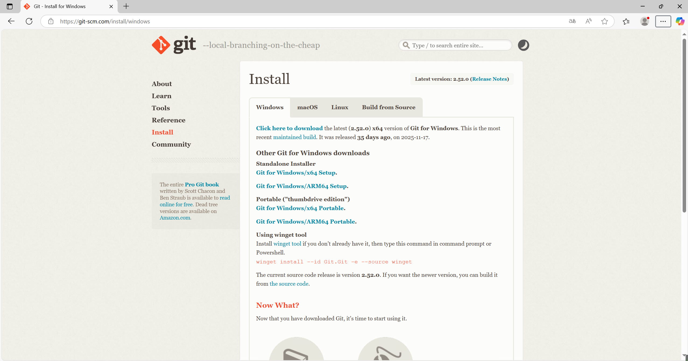
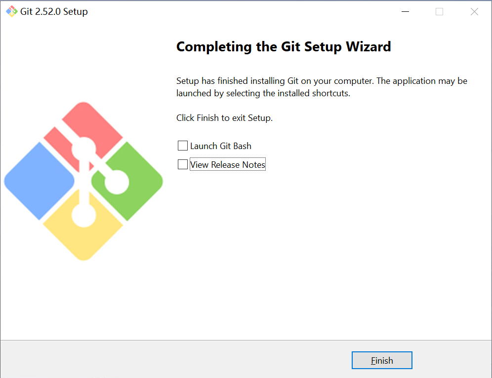
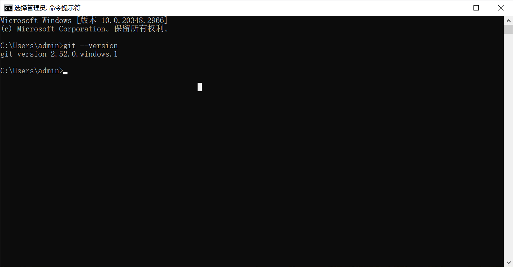
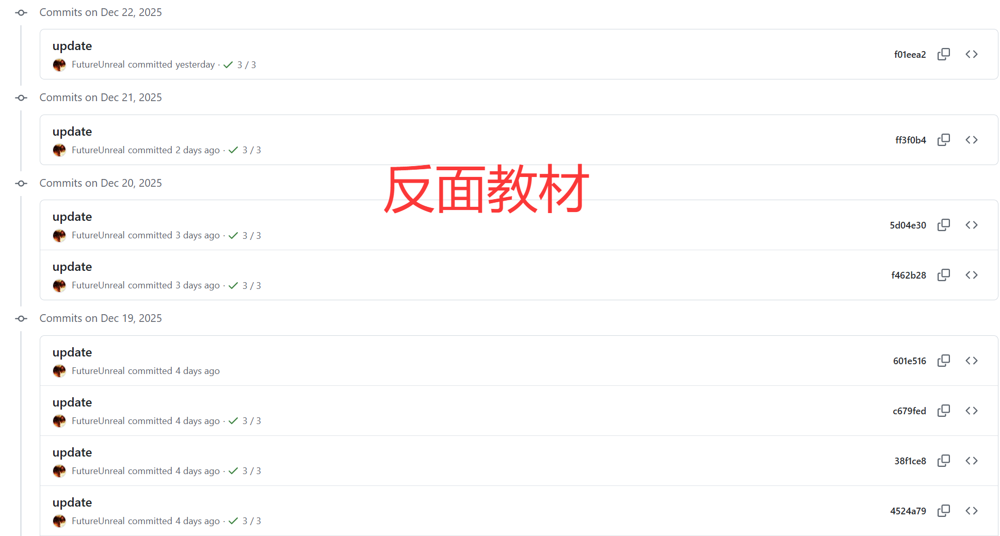

# 第一节 搭建 Jenkins CI/CD 自动化部署流水线

上一章，我们成功利用 Docker 和 Docker Compose 将 NER 模型服务进行了容器化封装。实现了“一次构建，随处运行”的目标，缓解了环境不一致的问题。

但是，随着业务发展，我们的项目代码每天都在更新。每次修改完代码，都需要手动在本地构建镜像、推送到服务器、登录服务器、停止旧容器、启动新容器……如果像某些互联网大厂那样，一天需要发版十几次，或者服务器集群有几十台，这种手动操作的方式显然效率极低，而且一旦操作失误（比如误删文件、覆盖了错误版本），回滚起来也异常痛苦。

为了解决这个问题，企业通常会建设一套 **CI/CD（持续集成/持续发布）** 平台。本章我们将介绍如何引入 **Git** 和 **Jenkins**，将开发和运维结合起来，实现代码一经提交，自动触发构建、测试和部署的“智能流水线”。

## 一、DevOps 与 CI/CD 概述

### 1.1 什么是 DevOps？

在了解具体的工具之前，我们需要先理解其背后的核心思想——**DevOps**。DevOps 是 Development（开发）和 Operations（运维）两个词的组合。软件开发模式经历了好几个时代的演进，理解这个过程有助于我们明白为什么现在需要 DevOps。

-  **原始时代（个人经验驱动，1950s-1960s）：**
   在计算机发展的早期，软件开发完全依赖程序员的个人能力。没有统一的流程和标准，大家都是“写完就改”（Code and Fix）。这种模式像个手工作坊，高度依赖个人，一旦核心人员离职，项目往往就会陷入混乱，难以维护和扩展。

-  **瀑布模型（线性流程，1970s-1990s）：**
   为了解决混乱，人们借鉴了建筑工程的管理方法，引入了**瀑布模型**。它将开发过程划分为需求、设计、编码、测试、维护等严格的阶段，前一个阶段完成后才能进入下一个阶段。这虽然带来了规范，但过于僵化。就像做一张桌子，如果在最后验收时发现设计图纸一开始就画错了，要修改就必须推倒重来，成本极高。

-  **敏捷开发（小步快跑，1990s-2000s）：**
   为了应对需求频繁变更，**敏捷开发**（Agile）出现了。它不再追求一次性交付完美的成品，而是强调**迭代**。先把最核心的功能做出来（比如先做一个能用的桌子腿），给用户看，根据反馈快速调整，再做下一个模块。就像把一个大项目拆成了无数个小周期（Sprint），每个周期都能交付可用的软件，大大提高了灵活性。

-  **DevOps（智能流水线，2000s-至今）：**
   现在的 DevOps 则是更进一步，它打破了开发和运维之间的隔阂。在传统模式下，开发只管写代码，运维只管部署，中间容易扯皮。DevOps 通过**自动化工具链**（CI/CD）将开发、测试、部署紧密连接。开发人员只需提交代码，平台就会自动完成构建、测试、发布等后续所有工作。这就像一条智能的流水线，不仅生产效率高，还能实时监控、快速修复，让软件交付变得像“工厂流水线”一样标准和高效。

### 1.2 CI/CD 的核心价值

CI/CD 是 DevOps 理念落地的关键实践，它通过将软件开发中的构建、测试、部署等环节自动化，极大地提升了研发效率和质量。

1. **CI (Continuous Integration，持续集成)**

开发人员频繁地将代码集成到共享的主干分支。**每次提交代码后，系统自动触发构建（Build）和自动化测试（Test）**。通过自动化测试的快速反馈，避免在项目后期才发现大量冲突和错误的“集成地狱”（Integration Hell）。同时，强制的代码规范检查和单元测试，保证合入主干的代码是“健康”的，显著**提高代码质量**，并让团队成员通过构建状态实时了解项目的健康程度，增强开发的**透明度**。

2. **CD (Continuous Delivery/Deployment，持续交付/部署)**

在持续集成的基础上，将代码自动部署到测试环境甚至生产环境。它涵盖了自动化部署、环境配置管理和发布流程编排。这一过程的价值在于**缩短上市时间**（Time to Market），代码从开发完成到上线的时间被压缩到最短，使企业能快速响应市场变化。而且，由于发布频率高，每次发布的变更量小，即使出问题也容易排查和回滚，从而大幅**降低了发布风险**。这也把运维人员从繁琐、易错的熬夜手动发版中**解放出来**，让机器自动执行标准化流程。

简而言之，CI/CD 就像一个**不知疲倦的智能管家**。它在保证质量的前提下，让软件交付变得像“工厂流水线”一样标准、高效且可靠，开发人员能专注于业务逻辑，而不是被繁琐的部署流程所困扰。我们当前的目标就是搭建这样一套流程，**本地代码提交 (Git) -> 代码仓库 (GitLab/Gitee) -> Jenkins 自动构建 -> 部署到服务器**。而这一切的基础，首先是**版本控制**。

## 二、Git 版本控制基础

### 2.1 为什么需要版本控制？

CI/CD 的源头是代码，而管理代码的核心工具是 **Git**。在没有版本控制的年代，如果张三和李四同时修改了服务器上的 `nginx.conf` 配置文件，可能会出现李四覆盖了张三的内容、改错了无法回退到昨天的版本、不知道谁在何时改了哪一行等问题。**版本控制系统 (VCS)** 就是为了解决这些问题而诞生的。它给文件的每一次修改都打上一个“版本号”（标签），记录了谁在什么时候改了什么，进而支持历史追踪、多人协作和版本回退。

市面上的版本控制软件主要分为两类：
- **集中式（如 SVN）**：有一个中央服务器保存所有代码，大家都要联网去提交。缺点是如果中央服务器挂了，大家都干不了活，且严重依赖网络。

- **分布式（如 Git）**：没有绝对的中央服务器，**每个人电脑上都是一个完整的版本库**。即使断网，你也能在本地提交代码、查看历史。这是目前最主流的方案。

> Git 是 Linux 之父 Linus Torvalds 为了管理 Linux 内核代码而开发的。因为他对当时的收费版本控制软件并不满意，一怒之下用了两周时间用 C 语言手撸了一个 Git。它继承了 Linux 的基因，开源、免费、高效且强大。

### 2.2 Git 的安装与配置

Git 支持 Windows、macOS 和 Linux 等多种平台。

1. **Windows 系统安装**

对于 Windows 用户，Git 官方提供了方便的安装包：

- **下载**：访问 Git 官网 [git-scm.com](https://git-scm.com/)，点击首页的“Install for Windows”按钮。进入下载页面如图 15-2，在此页面中，需要**根据自己的电脑架构**选择对应的安装程序。如果是常见的 Intel/AMD 芯片电脑，可以直接点击“Click here to download”；如果是 ARM 架构设备，则选择“Git for Windows ARM64 Setup”。

<p align="center">
  
  <br />
  <em>图 15-2 Git for Windows 下载页面</em>
</p>

- **安装**：双击运行下载的 `.exe` 文件。安装向导中会有很多选项（如编辑器选择、路径环境配置等），对于初学者，**一路点击 "Next" 使用默认设置**即可。等待安装进度条走完，就能看到如图 15-3 所示的安装完成界面。

<p align="center">
  
  <br />
  <em>图 15-3 Git 安装完成界面</em>
</p>

2. **Linux 系统安装**

大多数 Linux 发行版（如 Ubuntu/CentOS）已经内置了 Git。可以通过命令行直接检查或安装：

```bash
# 检查是否已安装
git --version

# 如果未安装，使用包管理器安装
# Ubuntu/Debian
sudo apt install git
# CentOS/RHEL
sudo yum install git
```

3. **验证安装**

无论是在 Windows 的 PowerShell/CMD 还是 Linux 终端中，安装完成后都可以通过以下命令验证是否成功：

```bash
git --version
```

<p align="center">
  
  <br />
  <em>图 15-4 Git 版本验证</em>
</p>

4. **配置身份信息**

安装完成后，必须先配置**用户身份**。因为 Git 是分布式的，它需要知道提交代码的是谁。

```bash
# 配置用户名
git config --global user.name "YourName"

# 配置邮箱
git config --global user.email "your_email@example.com"

# (可选) 开启命令行颜色显示，让输出更友好
git config --global color.ui true
```

> 这里的配置仅用于在提交历史中记录开发者身份，**并不是用于登录远程代码仓库的账号密码**。不过为了便于识别**建议填写与注册代码托管平台（ GitHub/Gitee 等）时一致的用户名和邮箱**。

查看配置是否生效：
```bash
git config --list
```

输出如下：
```bash
...
user.name=base-nlp
user.email=base-nlp@example.com
color.ui=true
```

### 2.3 创建本地仓库与核心工作流

Git 的核心操作围绕三个区域展开，如图 15-5 分别是**工作区**、**暂存区**和**版本库**。这三个区域协同工作，构成了 Git 的基本工作流。

<p align="center">
  
  <br />
  <em>图 15-5 Git 工作流</em>
</p>

1. **初始化本地仓库**

普通的文件夹只是文件系统的一部分。要让 Git 管理它，需要进行初始化：

```bash
mkdir base-nlp
cd base-nlp
git init
```

执行 `git init` 后，目录下会生成一个隐藏的 `.git` 文件夹。这个文件夹就是 Git 的核心数据库（版本库），千万不要手动删除或修改它。

2. **“工作区”到“暂存区”**

我们在 `base-nlp` 目录下创建一个文件 `test.py`：

```bash
echo "print('hello world')" > test.py
```

此时，文件在**工作区**，Git 知道有这个文件，但它还没被跟踪。我们可以先通过 `git status` 看一下当前状态：

```bash
git status
```

输出如下：

```bash
On branch master

No commits yet

Untracked files:
  (use "git add <file>..." to include in what will be committed)
        test.py

nothing added to commit but untracked files present (use "git add" to track)
```

接下来，把它添加到**暂存区**：

```bash
git add test.py
# 或者使用 git add . 将当前目录所有修改加入暂存区
```

再次查看状态，可以看到文件已经进入暂存区，等待提交：

```bash
...
Changes to be committed:
  (use "git rm --cached <file>..." to unstage)
        new file:   test.py
```

暂存区相当于一个“缓冲地带”或“购物车”，可以在这里确认这一批修改是否完整。如果发现改错了，还可以从暂存区撤回，而不会污染正式的版本历史：

```bash
# 不想本次提交 test.py，可以把它从暂存区撤回
git rm --cached test.py
```

> 暂存区中的信息会被记录在 `.git/index` 文件中，通常不需要手动修改或查看这个文件。

3. **“暂存区”到“版本库”**

确认无误后，将暂存区的内容正式提交到仓库，生成一个新的版本：

```bash
git commit -m "first commit: add test.py"
```

输出如下：

```bash
[master (root-commit) 7db0bb0] first commit: add test.py
 1 file changed, 1 insertion(+)
 create mode 100644 test.py
```

提交完成后再执行一次 `git status`，会看到工作区已经“干净”了：

```bash
On branch master
nothing to commit, working tree clean
```

**`-m` 参数很重要**，它代表本次提交的**备注信息**。清晰、有含义的备注能帮助我们将来在茫茫历史版本中快速找到需要的节点。推荐的写法是“**动词 + 对象**”，例如：

```bash
git commit -m "feat: 新增 NER 预测接口"
git commit -m "fix: 修复登录接口的 500 错误"
git commit -m "refactor: 抽取公共的日志封装函数"
```

而下面这种就不推荐使用，因为几乎没有任何信息量：

```bash
git commit -m "update"
git commit -m "test"
```

但是，嘿嘿。大家不要学👇

<p align="center">
  
  <br />
  <em>图 15-5 反面教材</em>
</p>

### 2.4 版本迭代与差异对比

随着开发进行，我们会不断修改代码。比如修改 `test.py`，替换一行代码：

```python
# 删除 print('hello world')
print('hello nlp')
```

此时使用 `git status` 查看状态，Git 会提示文件已修改（modified）。

```bash
On branch master
Changes not staged for commit:
  (use "git add <file>..." to update what will be committed)
  (use "git restore <file>..." to discard changes in working directory)
        modified:   test.py

no changes added to commit (use "git add" and/or "git commit -a")
```

我们可以使用 **`git diff`** 来查看具体改了什么，输出如下：

```bash
diff --git a/test.py b/test.py
index 75d9766..812e8d0 100644
--- a/test.py
+++ b/test.py
@@ -1 +1 @@
-print('hello world')
+print('hello nlp')
```

输出中会用绿色加号 `+` 表示新增的行，红色减号 `-` 表示删除的行。这能帮助我们在提交前最后确认修改内容。确认无误后，再次走一遍流程：

```bash
git add .
git commit -m "v2: update print output"
```

输出如下：

```bash
[master 3fa5369] v2: update print output
 1 file changed, 1 insertion(+), 1 deletion(-)
```

这样，我们就有了两个版本。如果发现 v2 有严重 bug，可以利用 Git 提供的能力快速回退到 v1。

### 2.5 查看提交历史与版本回退

顺着上面的例子，我们来进一步学习如何**查看历史版本**以及**回退到指定版本**。

1. **查看提交历史**

最基本的用法：

```bash
git log
```

它会按照**时间倒序**列出当前分支上的所有提交（最新的在最上面）。输出如下：

```bash
commit 3fa5369... (HEAD -> master)
Author: base-nlp <base-nlp@example.com>
Date:   ...

    v2: update print output

commit 7db0bb0...
Author: base-nlp <base-nlp@example.com>
Date:   ...

    first commit: add test.py
```

- 最上面一条就是当前分支 `master` 的最新提交，`HEAD -> master` 表示“当前 HEAD 指向 master 分支的这个提交”。  
- 每个提交前面那一长串十六进制字符串，就是唯一的 **Commit ID（提交哈希）**，后面是写的提交说明。

如果觉得默认输出太“啰嗦”，可以用参数 `--pretty=oneline` 将每条提交压缩成一行：

```bash
git log --pretty=oneline
```

输出如下：

```bash
3fa5369... v2: update print output
7db0bb0... first commit: add test.py
```

2. **回退到之前的版本**

目前我们已经做了两次提交：

- 第一次：`first commit: add test.py`  
- 第二次：`v2: update print output`

此时 `git log` 结果中，最上面的是 v2。如果我们发现 v2 有问题，想回退到 v1，可以使用：

```bash
git reset --hard HEAD^
```

其中：

- `HEAD` 代表当前版本；  
- `HEAD^`（等价于 `HEAD~1`）代表**上一个版本**；  
- `HEAD~2` 代表上上个版本，以此类推。

执行 `git reset --hard HEAD^` 后，输出如下：

```bash
HEAD is now at 7db0bb0 first commit: add test.py
```

- 这行提示说明 `HEAD` 现在指向了提交 `7db0bb0`（也就是第一次提交）。  
- 同时，`HEAD` 和 `master` 会从 v2 移动到 v1，工作区和暂存区的内容也会一起回滚到 v1 时的代码状态。

此时使用 `cat test.py` 查看 `test.py`，就会发现它的内容已经恢复到第一次提交时的样子。接下来运行 `git log` 也只会看到 v1 这一条提交记录了。

除了用 `HEAD^` 这种相对写法，我们也可以通过 **Commit ID 精确切换到指定版本**。比如在已经回退到 v1 之后，如果确认 v2 没问题，想从 v1 回到 v2，可以执行：

```bash
git reset --hard 3fa5369
```

输出如下：

```bash
HEAD is now at 3fa5369 v2: update print output
```

这里的 `3fa5369` 就是 `git log` 输出中 v2 那条提交前面的那一段哈希值（只需要写前几位，能唯一匹配即可）。

> `--hard` 会丢弃当前工作区和暂存区中**尚未提交**的修改，实际工作中使用前一定要确认没有重要改动未提交。

`git reset` 其实还有三种常见模式，可以简单对比一下（了解即可）：

- `git reset --soft <commit>`：
 
  只移动 `HEAD`，**保留暂存区和工作区**，适合“合并多次提交”为一次。  
- `git reset --mixed <commit>`（默认）：
 
  移动 `HEAD`，重置**暂存区**，但**保留工作区**的文件内容。  
- `git reset --hard <commit>`：

  `HEAD`、暂存区和工作区**全部回滚**到指定提交，最“干净”，也最危险。

3. **查看所有操作历史**

有时候我们已经执行了 `git reset --hard`，在 `git log` 里看不到“被回退掉”的提交了，这时可以使用：

```bash
git reflog
```

`git reflog` 会记录 **HEAD 的每一次移动**（包括 `commit`、`reset`、`checkout` 等），输出如下：

```bash
3fa5369 (HEAD -> master) HEAD@{0}: reset: moving to 3fa5369
7db0bb0 HEAD@{1}: reset: moving to HEAD^
3fa5369 (HEAD -> master) HEAD@{2}: commit: v2: update print output
7db0bb0 HEAD@{3}: commit (initial): first commit: add test.py
```

这四行依次记录了我们刚才做过的操作：

- `HEAD@{3}`：第一次提交 `first commit: add test.py`，生成 v1；  
- `HEAD@{2}`：第二次提交 `v2: update print output`，生成 v2；  
- `HEAD@{1}`：执行 `git reset --hard HEAD^`，从 v2 回到 v1；  
- `HEAD@{0}`：执行 `git reset --hard 3fa5369`，又从 v1 回到 v2。

无论是从 v2 回到 v1，还是又从 v1 回到 v2，这些“时光旅行”都会被 `git reflog` 记录下来。将来只要在 `git reflog` 中找到目标状态前面的 Commit ID，就可以再次通过 `git reset --hard <commit_id>` 把代码“穿越回去”。所以，`git log` 主要用来“看版本历史”，`git reflog` 更像是记录**所有关键操作**的“黑匣子”，可以在“手滑 reset” 之后救命。
