# 第三节 手撕大模型生成策略

前两节我们通过 Llama2 和 MoE，深入理解了大模型的**网络架构**（即“大脑”是如何构造的）。但仅有架构还不够，模型前向传播输出的仅仅是概率分布（Logits），如何将这些概率一步步转化为流畅的文本，就是本节要探讨的核心——**解码策略**。我们将回到成熟的 **Transformers** 库，以 GPT 模型为例，避开繁琐的数学公式，直接通过**代码调试**的方式，探究 `model.generate()` 的底层工作原理，看看从“输入 Prompt”到“输出文本”的完整数据流是如何在代码中流转的。

## 一、“逐 token 生成”在做什么

### 1.1 从 Pipeline 入手调试准备

我们重新打开在第五章中实现的 [GPT 实战代码](https://github.com/datawhalechina/base-nlp/blob/main/code/C5/02_gpt_usage.py)，如图 6-16 注释掉其他内容，只保留文件最后的 `# pipeline 应用` 的部分以及相关初始化变量。具体调试方法可以参考第八章 [NER 项目的数据处理](https://github.com/datawhalechina/base-nlp/blob/main/docs/chapter8/02_data_processing.md#211-%E8%B0%83%E8%AF%95%E8%A7%82%E5%AF%9F%E6%95%B0%E6%8D%AE%E7%BB%93%E6%9E%84)中的简单说明。

<p align="center">
  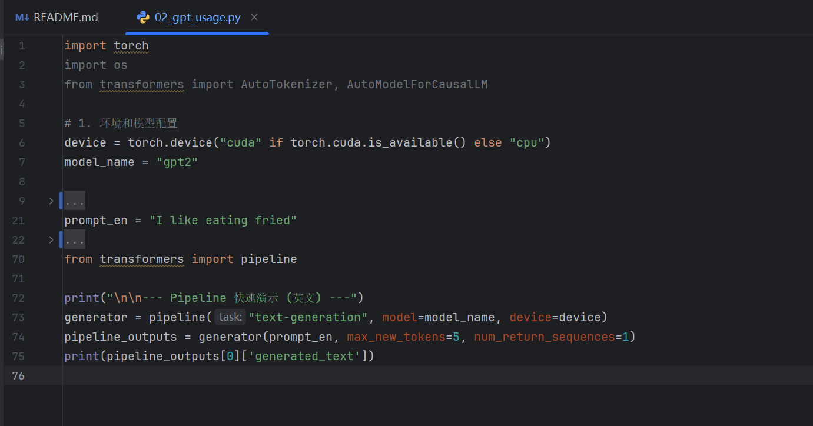
  <br />
  <em>图 6-16 Pipeline 调试代码准备</em>
</p>

接下来按下面步骤进行调试：

（1）在 `pipeline_outputs = generator(prompt_en, max_new_tokens=5, num_return_sequences=1)` 这一行打断点。Debug 运行脚本，程序停住后，**步入（Step Into）**，如图 6-17 我们就进入 Transformers 包内部代码。

<p align="center">
  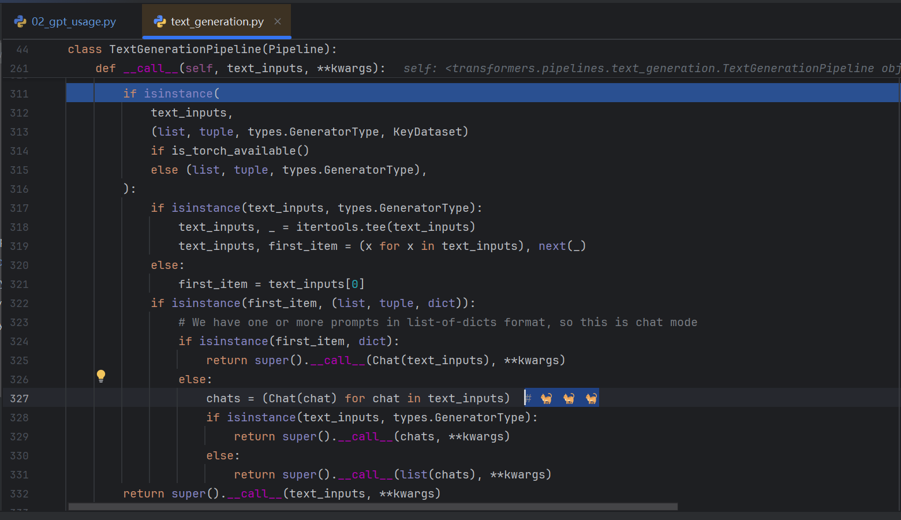
  <br />
  <em>图 6-17 Pipeline 源码</em>
</p>

> 可以看到图中源码的猫咪 emoji（🐈 🐈 🐈）。Hugging Face 的三位创始人都是法国人，而在法语中 “chat” 就是猫的意思，所以工程师用它暗示这里有“一堆 chats（猫）”。哈哈，极客幽默。

（2）言归正传，接下来我们需要在 `text_generation.py` 文件中的四个位置下断点。分别在 `preprocess()` 最后找到 `return inputs` 这一行；在 `_forward()` 中找到 `output = self.model.generate(`；在 `postprocess()` 的循环里找到 `text = self.tokenizer.decode(` 和 `if return_type == ReturnType.FULL_TEXT:`，然后把断点打在这四行。

> 调试器命中断点时通常会停在该行“执行之前”，所以如果某个变量是“在这一行才刚被赋值/更新”的，需要**单步执行一次**或把断点下在**下一行**，才能看到它的最终值。

（3）断点下好后，点击 **恢复程序（Continue / Resume）**，程序会依次停在这四个位置。

### 1.2 Pipeline 接口的输入与输出结构

（1）停在 `preprocess()`：看模型“吃进去”的是什么

在前处理阶段，展开 `inputs` 我们看看模型“吃进去”的到底是什么。如图 6-18 所示，会发现**文本被 tokenizer 变成了 token ids 以及 mask**（见 `input_ids` 和 `attention_mask`），同时 pipeline 还会保留原始输入 `prompt_text`，这是为了后处理时能拼回 **FULL_TEXT**。在图中可以看到 `input_ids` 和 `attention_mask` 形状是 `Tensor: (1, 4)`，对应我们的输入 `I like eating fried`，第 1 维 = batch size = 1（本次只输入 1 条 prompt），第 2 维 = 序列长度 = 4（这条 prompt 被 tokenizer 切成了 4 个 token）。

<p align="center">
  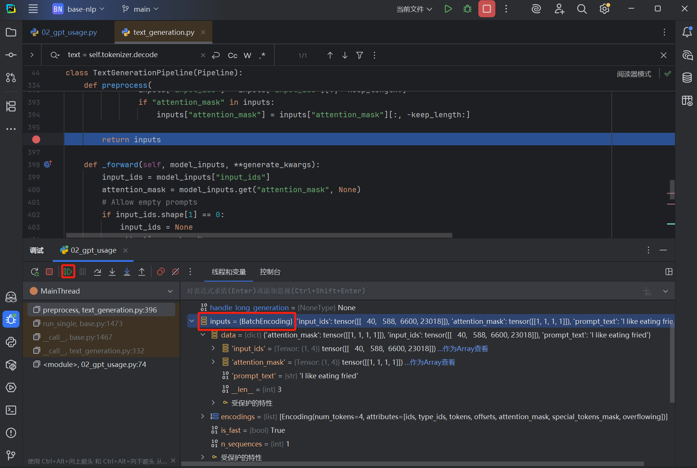
  <br />
  <em>图 6-18 前处理阶段的 inputs 结构</em>
</p>

（2）停在 `_forward()`：确认真正的解码发生在 `model.generate()`

这里我们可以看到 **Pipeline 只是把参数整理好，真正的解码策略发生在 `model.generate()` 里**。如图 6-19 这里就是“最终生效”的生成参数，可以看到这里传入了我们在前处理阶段得到的 `input_ids` 和 `attention_mask`，同时还有我们在 `generator()` 中传入的 `max_new_tokens=5`、`num_return_sequences=1` 两个参数。

<p align="center">
  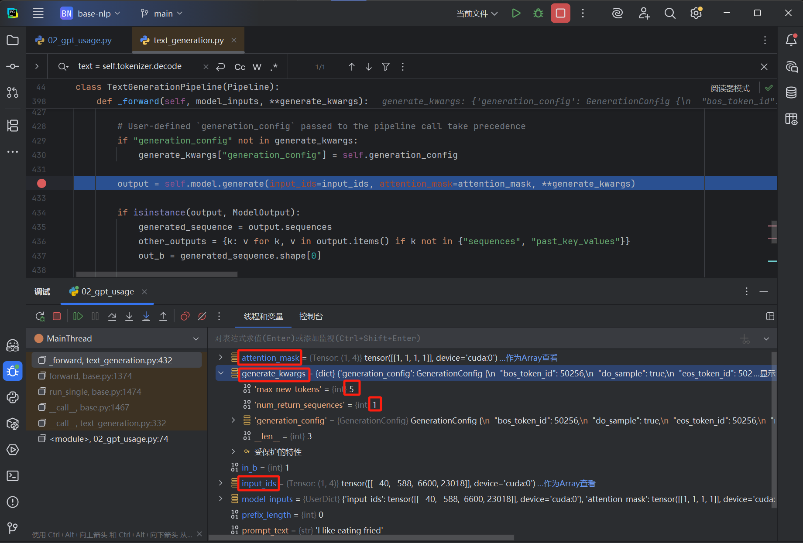
  <br />
  <em>图 6-19 推理生成阶段传递生成参数</em>
</p>

（3）停在 `postprocess()`：把 token ids 还原成文本，并决定返回 FULL/NEW

后处理阶段的任务就是把生成出来的 token ids 用 `tokenizer.decode(...)` 还原成文本，并决定返回 **FULL_TEXT/NEW_TEXT**。

- 如图 6-20，程序首先停在 `text = self.tokenizer.decode(` 的位置。这里有个关键参数 `sequence`：通过 `Ctrl + B`（转到定义）回溯可以发现，这个值来自 `model_outputs["generated_sequence"][0]`。所以实际上在 Transformers 的实现里，模型推理结束后会得到一个字典，包含 `'generated_sequence'`、`'input_ids'` 以及 `'prompt_text'`。接下来 `generated_sequence` 会被转换成 Python 列表，并在 `for idx, sequence in enumerate(generated_sequence):` 里逐条取出，因此此处的 `sequence` 本质上就是“一条生成序列”的 token id 列表。观察 `sequence` 的值可以看到：前面的四个 `40, 588, 6600, 23018` 是我们的输入 token，而后面五个 `9015, 553, 531, 262, 582` 则是模型新生成的内容，并且与 `max_new_tokens=5` 的设置对应。

  <p align="center">
    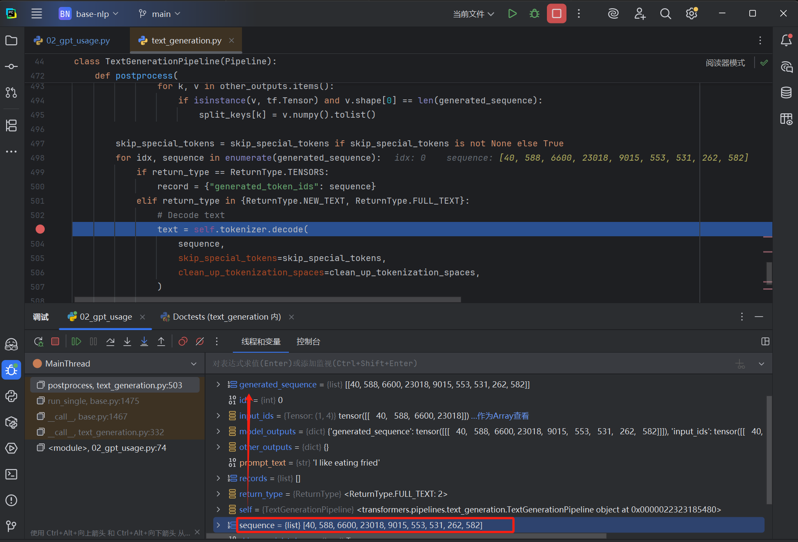
    <br />
    <em>图 6-20 后处理阶段的 sequence</em>
  </p>

- 再次恢复程序会停到 `if return_type == ReturnType.FULL_TEXT:`。此时重点看 `prompt_length` 和 `all_text`：`prompt_length` 表示“prompt 在 decode 后的长度”，Pipeline 用它把 `text` 的前半段（prompt 部分）裁掉，得到“新增内容” `all_text`（也就是 **NEW_TEXT**）。如图 6-21 所示，本次推理的结果被 decode 成字符串后的结果是 `' chicken, but I like'`，而 `prompt_length=19` 也刚好对应 “**"I"(1) + 空格(1) + "like"(4) + 空格(1) + "eating"(6) + 空格(1) + "fried"(5) = 19**”。如果设置的是 **FULL_TEXT**（默认值），Pipeline 会在后面把 `prompt_text` 再拼回去，所以最终输出会包含原始 prompt。如果想看到最后输出的结果，也可以在当前代码文件尾部 `return records` 的位置继续下断点，这里就不再赘述。

  <p align="center">
    
    <br />
    <em>图 6-21 后处理阶段的 prompt_length 与 all_text</em>
  </p>

### 1.3 分析解码流程

刚才提到了真正的解码策略发生在 `model.generate()` 里，那么接下来我们取消掉除了 `output = self.model.generate(` 这行之外的其他三处断点，然后重新调试。

（1）**步入**进去 `text_generation.py` 后恢复程序会停到 `output = self.model.generate(` 这行，然后我们对 `generate()` 方法 Ctrl + B 转到定义，这时一般会跳到 `generation/utils.py`（或同类路径）里定义 `generate()` 方法的地方。接着在下面找到 `generation_config, model_kwargs = self._prepare_generation_config(` 下完断点后恢复程序。

（2）如图 6-22，我们可以看到 `GenerationConfig` 的配置如下，这些配置在本地下载的模型 `config.json` 文件中也有体现。同时我们还可以看一下 `kwargs` 中的内容，这就是我们传入 `generate()` 的参数。

```text
GenerationConfig {
  "bos_token_id": 50256,
  "do_sample": true,
  "eos_token_id": 50256,
  "max_length": 50,
  "max_new_tokens": 256,
  "temperature": 0.7
}
```

其中，`bos_token_id` 是生成起始 token（当 `inputs=None` 时会用它来“起一个头”）；`eos_token_id` 是结束 token（生成到它或满足停止条件就停止）；`do_sample` 表示是否采样（`False` 更确定，`True` 更有随机性/多样性）；`temperature` 是采样温度（越大越随机，越小越保守）；`max_length` 是总长度上限（prompt+新生成）；`max_new_tokens` 是新增 token 上限（如果同时设置了 `max_length`，以最终合并后的配置为准）。

<p align="center">
  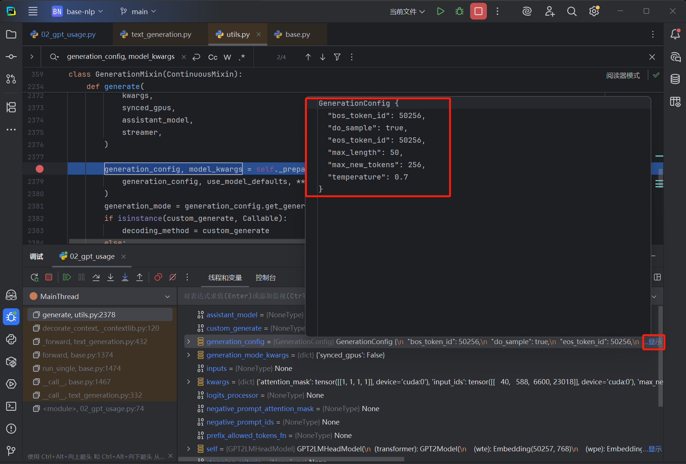
  <br />
  <em>图 6-22 默认的 GenerationConfig</em>
</p>

（3）接着在 `generation_mode = generation_config.get_generation_mode(assistant_model)` 这行也下个断点。恢复程序后，我们可以看到多了个变量 `model_kwargs`，其中包括了 `input_ids` 和 `attention_mask`。同时 `GenerationConfig` 中的默认值（如 `max_new_tokens`）也被传参覆盖。

（4）我们下一步看看本次推理会走哪种解码策略，可以选择在 `decoding_method = getattr(type(self), GENERATION_MODES_MAPPING[generation_mode])` 这行下个断点，也可以直接步过（Step Over）。如图 6-23 可以看到 `generation_mode` 的值是 `<GenerationMode.SAMPLE: 'sample'>`，说明本次会走**采样（Sampling）**分支：通常对应 `do_sample=True` 且 `num_beams=1`（区别于 `do_sample=False,num_beams=1` 的贪心，以及 `num_beams>1` 的 beam 系列策略；如果 `do_sample=True` 且 `num_beams>1`，则会走 `BEAM_SAMPLE`）。采样的含义是每一步不是“永远选概率最大的 token”，而是在（可能经过 `temperature/top_k/top_p` 等处理后的）概率分布上随机采样一个 token，所以输出通常会更有多样性。这部分具体判定代码可以使用 Ctrl + B 转到 `generation_config.get_generation_mode(...)` 的代码定义进行查看。

<p align="center">
  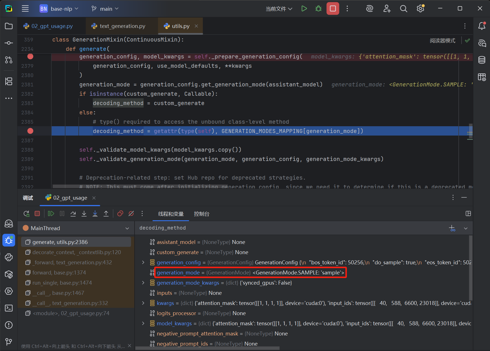
  <br />
  <em>图 6-23 解码策略分支选择</em>
</p>

（5）继续往下走，我们看一下输入张量 `inputs_tensor` 怎么变成 `input_ids`。我们首先把断点下在 `if "inputs_tensor" in inspect.signature(decoding_method).parameters.keys():` 这行。此时 `_prepare_model_inputs()` 执行完成后，如图 6-24 我们可以看到 `model_kwargs` 中的 `input_ids` 被拆成了 `inputs_tensor`，而且有一个新变量 `model_input_name`。`model_input_name` 相当于一个标签，代表 `inputs_tensor` 对应的是哪一种输入类型。

<p align="center">
  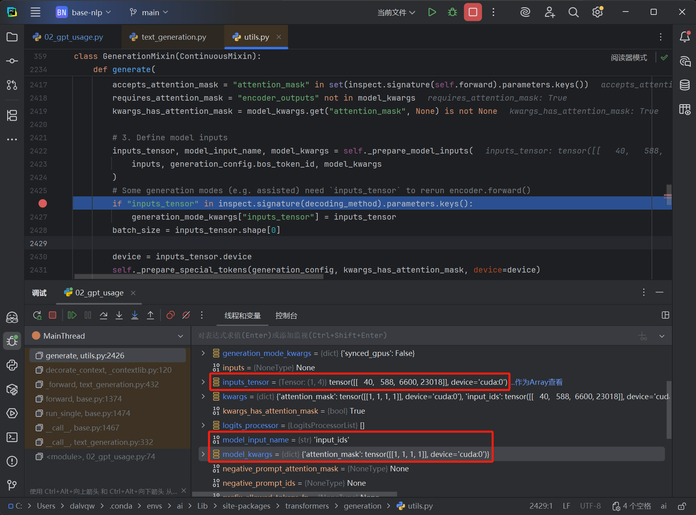
  <br />
  <em>图 6-24 model_input_name 标记输入类型</em>
</p>

（6）如果 `num_return_sequences>1`（一次要返回多条候选）或 `num_beams>1`（beam search 需要多条 beam 路径），那么同一条 prompt 的 `input_ids`（以及 `attention_mask`）会在 batch 维度被复制 `expand_size=max(num_beams, num_return_sequences)` 份，用来并行生成；如果这两个值都是 1，就会看到这里“几乎没变化”。另外我们还可以在 `if generation_config.token_healing:` 这行下断点，此时能看到“扩展后”的 `input_ids`（以及 `model_kwargs` 里的 `attention_mask`）形状，同时也能确认 `generation_config.token_healing` 是否开启（开启时下一行会对 `input_ids` 做一次 `heal_tokens` 处理）。

（7）当前代码文件的最后一处断点我们可以下在 `result = decoding_method(`，这里是真正的逐 token 生成循环入口。当恢复程序代码停在这里后，如图 6-25 我们可以看一下传入 `decoding_method(...)` 的几个参数。这里主要说明一下 `prepared_logits_processor` 跟 `prepared_stopping_criteria` 的作用，其他几个参数可能具体值有些变化不过作用没什么变化就不再赘述。当前的 `prepared_logits_processor` 可以理解为“每一步选 token 之前对 logits 做规则化修正”的一串处理器（例如最小长度、坏词过滤、重复惩罚等都会在这里把某些 token 的概率压低/置为 `-inf`），而 `prepared_stopping_criteria` 则是一组“什么时候该停止生成”的判定条件（例如达到最大长度、遇到 `eos_token_id` 或满足自定义停止条件时就结束循环）。

<p align="center">
  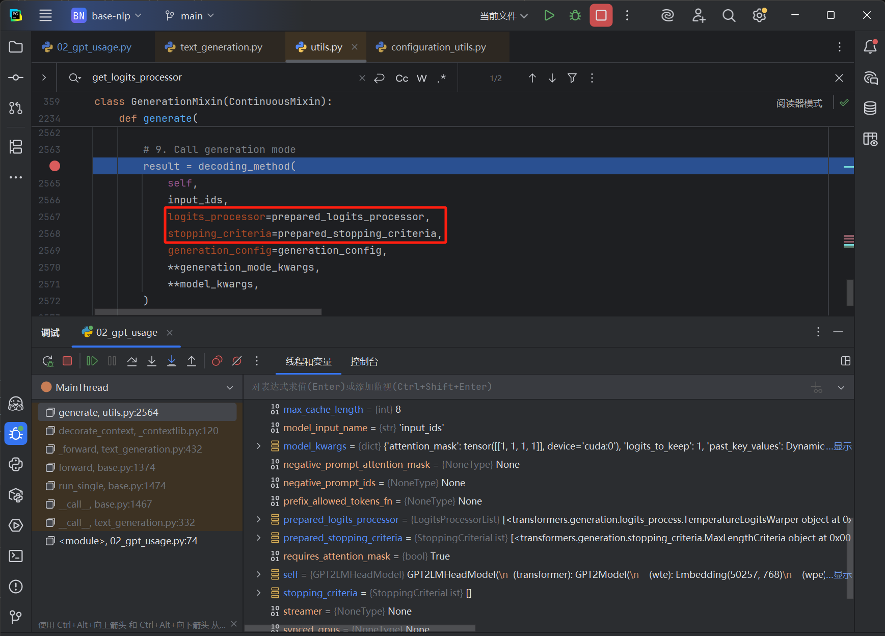
  <br />
  <em>图 6-25 decoding_method(...) 入参</em>
</p>

（8）最后在这行多次点击步入后，我们就进入了本次推理阶段实际执行的解码循环 `_sample()` 方法，这部分我们暂时先简单总结一下代码逻辑。`_sample()` 方法的内部是一个 while 循环，每一轮先用 `prepare_inputs_for_generation(...)` 基于当前 `input_ids` 准备本轮模型输入，然后做一次 forward 得到 `outputs.logits[:, -1, :]`（只取“最后一个位置”的 logits），再把 logits 交给 `logits_processor(...)` 做规则化修正，随后根据 `do_sample` 选择采样（`torch.multinomial`）或贪心（`argmax`）得到 `next_tokens`，把新 token 拼回 `input_ids`（`torch.cat`）作为下一轮输入；最后用 `stopping_criteria(input_ids, scores)` 判断是否满足停止条件（例如到达最大长度或遇到 `eos_token_id`），满足则跳出循环并返回生成的序列。如图 6-26，最终我们得到的这个 `(1, 9)` 的 `input_ids` 跟我们之前在后处理阶段看到的 `model_outputs["generated_sequence"][0]` 是一样的。

<p align="center">
  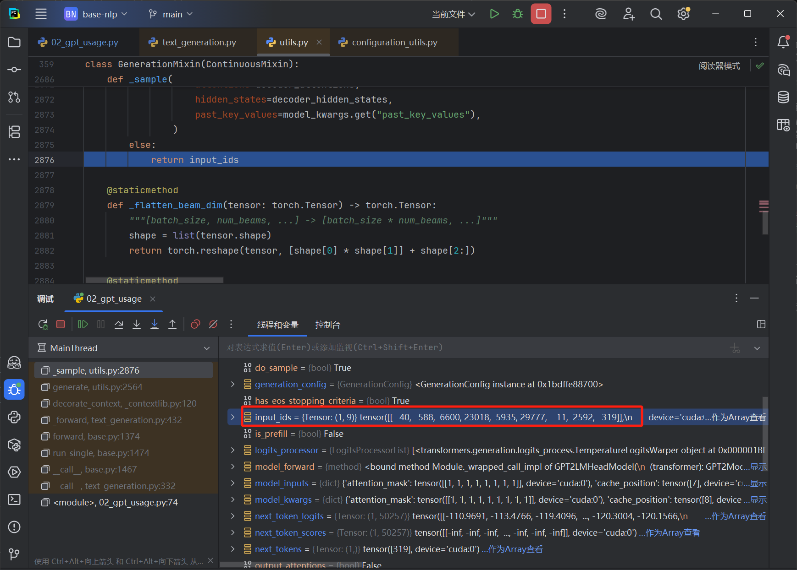
  <br />
  <em>图 6-26 _sample() 返回值</em>
</p>

### 1.4 从 Pipeline 到底层循环的完整调用链

经过上述对 `Pipeline` 和 `model.generate()` 的深度调试，我们可以将一次完整的文本生成任务归纳为以下 **5 个核心步骤**的接力跑：

（1）**预处理（Preprocess）**：Pipeline 的 `preprocess()` 方法调用 `tokenizer`，将原始字符串 `prompt_text` 转换为模型可识别的 **Token ID 张量** (`input_ids`) 和 **Attention Mask**。

（2）**入口分发**：Pipeline 的 `_forward()` 方法携带处理好的张量调用 `model.generate()`；在 `generate()` 内部，会先合并用户参数与 `GenerationConfig` 默认配置，确定最终的生成参数（如 `max_new_tokens`、`do_sample` 等）。

（3）**策略选择**：`generate()` 根据配置自动判断解码模式（Greedy / Sampling / Beam Search 等），并动态分发给对应的具体实现方法（如 `_sample()`, `_greedy_search()`, `_beam_search()`）。

（4）**解码循环**：进入具体方法（如 `_sample()`）后，开启 `while` 循环。

- **准备输入**：`prepare_inputs_for_generation()` 处理缓存 (`past_key_values`) 和当前输入。
- **模型前向**：执行 `model()` 得到最新的 `logits`。
- **规则修正**：`LogitsProcessor` 修改概率分布（如惩罚重复、限制词表）。
- **采样选择**：根据概率分布采样（`multinomial`）或贪心选择（`argmax`）得到 **Next Token**。
- **拼接更新**：将新 Token 拼接到 `input_ids` 末尾。
- **停止判定**：检查 `StoppingCriteria`（如是否遇到 EOS 或达到最大长度），决定是否跳出循环。

（5）**后处理（Postprocess）**：生成结束后得到的完整 `sequence` 会被送回 Pipeline 的 `postprocess()`，再调用 `tokenizer.decode()` 将 Token ID 序列还原为人类可读的字符串，并根据配置处理 `FULL_TEXT` / `NEW_TEXT` 的截取逻辑，最终返回给用户。

## 二、logits 规则链与常用解码策略

我们刚才已经能顺着断点走到 `result = decoding_method(`，并进一步步入到本次实际执行的策略方法（例如 `_sample()`）。接下来还有两个问题需要解决。第一，`get_logits_processor`（源码里常见的是 `_get_logits_processor`）到底往生成流程里“塞了哪些规则”，以及这些规则是在每一步如何修改 logits 的；第二，在这些规则生效之后，Greedy/Sampling/Beam 这几类策略分别是“怎么选下一 token”的。

### 2.1 logits 规则链是怎么构造出来的

（1）第一步“基操”，我们在 `prepared_logits_processor = self._get_logits_processor(` 下个断点，其他不需要的断点都可以取消，然后重新以调试方式运行代码。

（2）程序停下后先看看 `_get_logits_processor` 内传入了哪些参数。如图 6-27，我们可以看到 `input_ids_length` 的值为 4，那很显然“值如其名”这就是 `input_ids` 的长度。然后关注一下 `model_kwargs`，这里面多了两个不认识的值：

- `logits_to_keep` 是“本次 forward 只保留/只计算最后多少个位置的 logits”的提示参数（很多模型支持它来节省显存与计算量，当前取值是 1，表示只需要最后一个 token 位置的 logits 就够做 next-token 选择了）；
- `past_key_values` 是自回归解码的 KV Cache（缓存每一层注意力的 key/value），用于在下一步生成时复用历史计算结果，避免每一步都把整个序列从头算一遍，从而显著加速逐 token 生成。当前的这个 `DynamicCache(layers=[DynamicLayer, ...])` 就说明用的是 `DynamicCache` 这种缓存结构，而 `layers=[DynamicLayer, ...]` 有 12 个则表示模型有 12 层 Transformer block，每一层都有一份对应的缓存（每层一个 `DynamicLayer`）。缓存会随着生成过程逐步增长（每生成一个 token，每层的 K/V 都会多一列），用于下一步注意力计算直接复用历史 K/V，从而加速逐 token 生成。

<p align="center">
  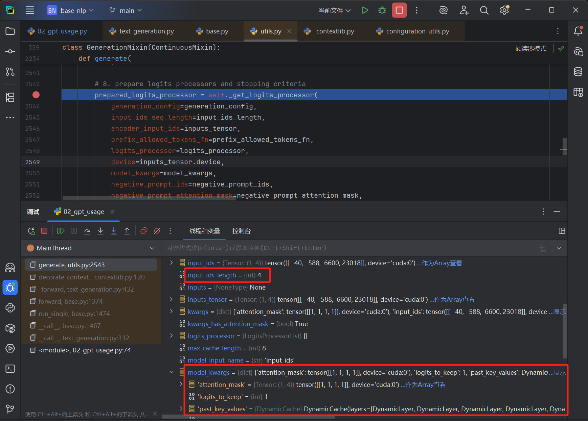
  <br />
  <em>图 6-27 _get_logits_processor 调用</em>
</p>

（3）接着点几次步入就进入了 `_get_logits_processor()` 的具体实现中，这时会看到 `processors` 还是一个空的 `LogitsProcessorList()`（因为规则链是“边判断边 append”的）。然后我们直接把断点下到最后 `return processors` 的位置。恢复程序停在这行之后，如图 6-28 我们观察一下 `processors` 的值具体包含了什么。我们会发现它已经变成一个“规则链”，里面依次追加了采样相关的 Warper，例如 `TemperatureLogitsWarper(temperature=0.7)`（温度缩放，控制随机性强弱）和 `TopKLogitsWarper(top_k=50, filter_value=-inf)`（只保留 top-k 候选，其余置为 `-inf`，避免在全词表里乱抽）。如果我们同时设置了 `top_p/typical_p/epsilon_cutoff/eta_cutoff`，这里也会出现对应的 Warper。所以实际上 `_get_logits_processor()` 的作用就是把我们在 generation_config/kwargs 里写的“生成控制参数”，翻译成一个“每一步生成都会执行的 logits 处理规则链”（LogitsProcessorList）并按顺序组装好返回。

<p align="center">
  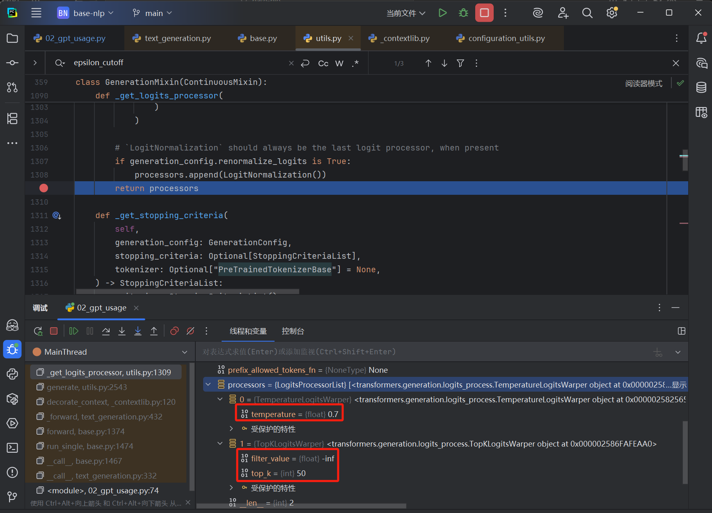
  <br />
  <em>图 6-28 processors（logits 规则链）示例</em>
</p>

（4）回到 `_sample()` 的循环，在 `next_token_scores = logits_processor(input_ids, next_token_logits)` 这一行下个断点。恢复程序后，我们可以看几个变量。首先找到 `outputs`，这个就是模型推理的输出，里面有个 `logits` 属性。当前 `logits` 的形状是 `(batch_size, seq_len, vocab_size)`，这里会看到 `(1, 1, 50257)`：其中第一个 `1` 表示本次只推理 1 条输入（batch size = 1），第二个 `1` 表示本次 forward 只保留了 1 个位置的 logits（因为 `logits_to_keep=1`，只需要最后一个位置来做 next-token 选择），而 `50257` 就是词表大小（vocab_size），表示对词表里的每个 token 都给了一个分数。再看 `next_token_logits` 这个值来自 `outputs.logits[:, -1, :]`，形状会变成 `(batch_size, vocab_size)`（只取最后一个位置）。

（5）点击步入，我们会来到 `logits_process.py` 文件中 `LogitsProcessorList` 类的魔法方法。可以看到程序停在了 `for processor in self:`，这里的 self 是 `LogitsProcessorList`（本质是一个 list 容器），所以这个循环是在依次遍历列表里的每一个 warper 对象（本次推理的 warper 对象是 `TemperatureLogitsWarper` 和 `TopKLogitsWarper`）。接着点击几次步过条件判断语句会把我们带到 `scores` 赋值。然后点击步入，对于本次推理我们就跳转到了 `TemperatureLogitsWarper` 类的魔术方法，这里可以看到 `scores_processed = scores / self.temperature` 对 logits 做缩放（等价于把 logits 除以温度 $T$，$T<1$ 分布更尖更“确定”，$T>1$ 分布更平更“随机”）；

> 在 `TemperatureLogitsWarper` 里，形参名叫 `scores`，但它传进来的就是 softmax 之前的分数，所以也可以称其为 logits。这次缩放后面代入 softmax 后，就会让分布在 $T<1$ 时更尖锐、$T>1$ 时更平坦。假设模型输出为 $z=[2,1,0]$，温度缩放后用的是 $\mathrm{softmax}(z/T)$。
> - 当 $T=1$：就是原始 softmax，$e^2=7.389,e^1=2.718,e^0=1$，总和 $11.107$，所以概率约为 $[0.665,0.245,0.090]$。
> - 当 $T=0.5$（更小）：先除以 $0.5$ 得到 $[4,2,0]$，$e^4=54.598,e^2=7.389,e^0=1$，总和 $62.987$，概率约为 $[0.867,0.117,0.016]$，最大项更接近 1——分布更“尖”。
> - 当 $T=2$（更大）：先除以 $2$ 得到 $[1,0.5,0]$，$e^1=2.718,e^{0.5}=1.649,e^0=1$，总和 $5.367$，概率约为 $[0.506,0.307,0.186]$，更平均——分布更“平”。

（6）接着步过这次调用，我们就又回到了 `LogitsProcessorList` 类。然后重复刚才的步骤我们就来到了 `TopKLogitsWarper` 类的魔术方法：它会先用 `torch.topk(scores, top_k)[0][..., -1, None]` 取出“第 $k$ 大”的分数作为阈值，然后计算 `indices_to_remove = scores < threshold` 得到一个布尔 mask；步过后看到 `indices_to_remove` 里 **True 表示“需要被过滤掉”的 token（不在 top-k 里）**，False 表示保留；最后用 `scores.masked_fill(indices_to_remove, -inf)` 把这些 True 的位置统一置为 `-inf`，这样进入 softmax 后它们的概率就是 0，采样时永远不会被选到。类似地：

- `top_p`（nucleus sampling）会按概率从高到低排序，只保留累计概率达到 $p$ 的最小 token 集合，其余置为 `-inf`；
- `typical_p`（typical sampling）会按“局部典型性（local typicality）”来筛选 token，保留满足阈值的 token 集合（官方文档的表述是：local typicality 衡量“预测某个 token 的条件概率”与“从该分布随机抽一个 token 的期望条件概率”有多相似）；
- `epsilon_cutoff` 会在 **softmax 概率空间**做阈值过滤：当 `epsilon_cutoff` 设为 $0 < \epsilon < 1$ 时，只允许**条件概率**大于 `epsilon_cutoff` 的 token 参与采样，其余过滤；
- `eta_cutoff` 属于 **eta sampling**：它是 “locally typical sampling + epsilon sampling” 的混合形式。按官方文档描述，当 `eta_cutoff` 设为 $0 < \eta < 1$ 时，一个 token 只有在满足以下条件之一时才会被考虑。其概率 $p$ 大于 `eta_cutoff`，或 $p > \sqrt{\text{eta\_cutoff}} \cdot e^{-\text{entropy}}$ （其中 `entropy` 指当前分布的熵）。

> 不管是 `top_k` 还是 `top_p` 以及其他的这些，本质上都是“裁剪规则”。
> - `top_k`：每一步只保留分数最高的 **K 个 token**，其余置为 `-inf`（候选数量固定）。
> - `top_p`：每一步按概率从高到低累加，保留“累计概率 ≥ p 的最小 token 集合”，其余置为 `-inf`（候选数量动态，取决于分布“尖不尖”）。
>
> 因此 `top_k` 越小，越容易反复选到高分 token，输出更稳定，但也更容易变得模板化/重复；`top_p` 越小，也会更早截断到一小撮高概率 token，候选更少。
> 实际应用中 `temperature` 和 `top_p` 是“分工明确”的一对。`temperature` 把分布变尖/变平（决定“随机性强弱”），`top_p` 就是把低概率尾巴裁掉（决定“从哪些 token 里抽”）。`top_p` 和 `top_k` 没什么联动，如果同时开启，相当于是双重过滤，最后能被采样的 token 会落在“满足 top_k 的集合”和“满足 top_p 的集合”的交集里。

（7）继续步过，我们就跳出了 `logits_processor(...)`，而这个时候的 `next_token_scores` 就是被规则链修正后的 `logits`。接着继续步过，如图 6-29，经过 softmax 和按 `probs` 的概率分布随机抽样后我们就得到了第一个预测 token “**479**”。打开模型的 `vocab.json` 文件，检索一下可以看到这个词是 “**\u0120food**”，“**\u0120**”其实就是我们在学习 GPT 的过程中学习过的“**Ġ**”，这个前缀表示一个词的开始。那么本次推理的第一个单词显然就是 “**food**”。继续步过，下面这行 `if has_eos_stopping_criteria:` 就是判断某条序列是否已经“结束了”，如果结束了就把它后续每一步的 next_token 设成 pad_token_id，避免它继续生成乱七八糟的 token，同时保持 batch 里所有序列长度一致。

<p align="center">
  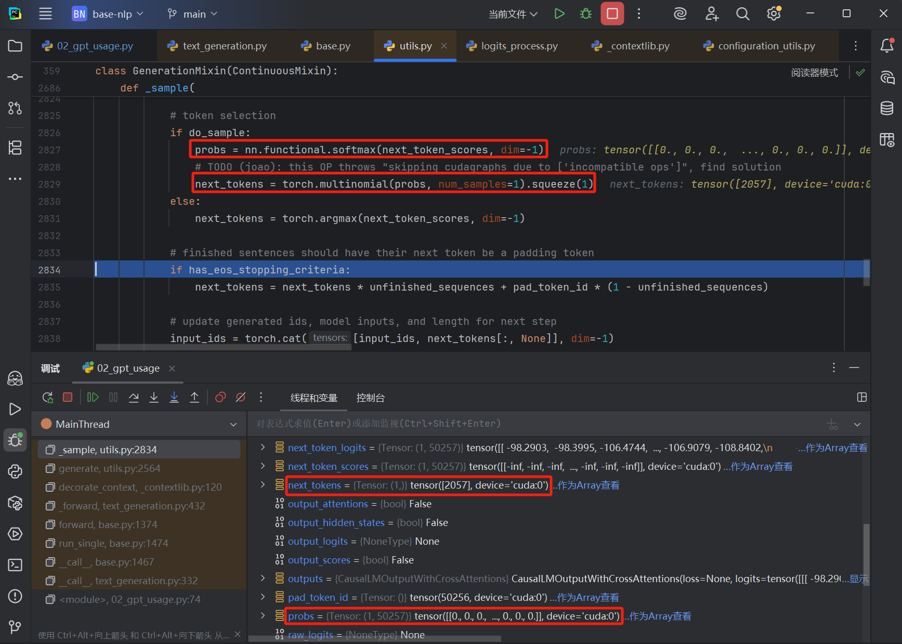
  <br />
  <em>图 6-29 第一个预测 token</em>
</p>

（8）最后继续步过，执行完 `input_ids = torch.cat([input_ids, next_tokens[:, None]], dim=-1)` 我们就能看到新的 token 已经追加到了 `input_ids` 后面。后面的 `unfinished_sequences = unfinished_sequences & ~stopping_criteria(input_ids, scores)` 就是判断本次 `while` 循环是否结束的，如图 6-30 所示，如果判断不停止就继续循环推理并生成下一个词。调试结束后就得到了本次的生成结果 “I like eating fried food. I'm in”。

<p align="center">
  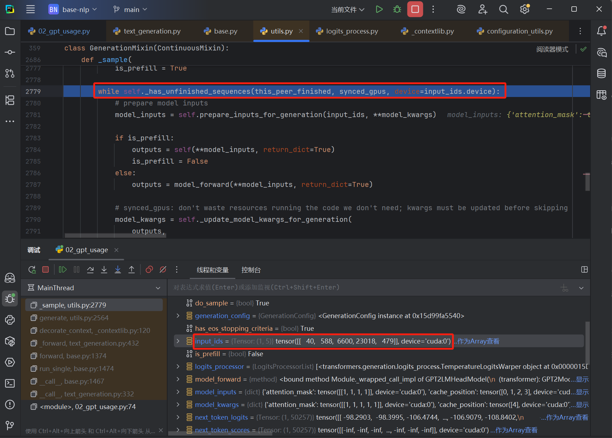
  <br />
  <em>图 6-30 继续循环推理</em>
</p>

### 2.2 常用解码策略

（1）Greedy Search（默认策略之一）：确定性地选最大值

当 `num_beams=1` 且 `do_sample=False` 时，`generate()` 通常会选择 Greedy Search（我们前面看到的 `GenerationMode.GREEDY_SEARCH`）。底层循环的核心非常简单：每一步 forward 得到 `outputs.logits[:, -1, :]`，先过一遍 `logits_processor(...)`，然后直接 `argmax` 选出分数最大的 token 作为 `next_tokens`，再把它拼回 `input_ids` 进入下一轮，直到 `stopping_criteria` 判定停止。Greedy 的好处是速度快、结果稳定，适合做 baseline 或需要强确定性的场景；缺点是容易陷入局部最优，开放式续写时更容易产生重复或“套路化”的输出。

（2）Sampling（抽样，LLM 开放式生成中最常用的家族）

在对话/开放式文本生成里，更常见的做法是开启采样（`do_sample=True`），并配合 `temperature/top_p/top_k` 来控制多样性与稳定性。以你已经步入过的 `_sample()` 为例：每一步拿到 `next_token_scores` 后先做 softmax 得到概率分布，再用 `torch.multinomial` 从该分布中抽一个 token；而 `temperature/top_p/top_k` 这些“看起来是策略参数”的东西，通常就是在 `logits_processor`（或同类 warper）里提前把分布处理好，保证采样只在合理候选集里进行。也就是说：Sampling 的“随机性”不是乱抽，而是“先按规则改分布，再从改过的分布里抽”。（Transformers 官方也把这类方法归为 generation strategies 的核心内容，可参考 [Hugging Face 的 generation strategies 文档](https://huggingface.co/docs/transformers/main/generation_strategies)。）

（3）Beam Sample（束采样）：beam 框架 + 采样

当 `num_beams>1` 且 `do_sample=True`（并且 `num_beam_groups==1`）时，`generate()` 通常会选择 `GenerationMode.BEAM_SAMPLE`。你可以把它理解成“beam search 的框架不变，但每一步的扩展不再是纯 top-k 硬选，而是引入采样带来的随机性/多样性”。它的适用场景通常是：既希望保留多条候选路径的搜索能力，又希望输出不要过于死板；但在大模型开放式对话里，工程上更常见的仍是直接 Sampling（`num_beams=1`）+ top-p/temperature，Beam Sample 相对少见一些，你可以把它当作“可选的折中策略”。

（4）Beam Search（束搜索）：更“序列级”的搜索，但更慢也更保守

当 `num_beams>1` 且 `do_sample=False` 时，`generate()` 通常会进入 `GenerationMode.BEAM_SEARCH`。beam 框架的核心是：每一步同时维护 `num_beams` 条候选序列（beams），对每条序列扩展出若干候选 token，并根据“累计分数”（常见做法是对 log 概率求和，并可能加上 `length_penalty`）进行排序剪枝，只保留最好的 `num_beams` 条继续滚动；这能更接近“序列级最优”，因此在翻译/摘要等任务里经常很稳。但在开放式生成中，beam search 往往更保守，也更容易出现某些重复/模板化模式，同时计算开销更大，所以在大语言模型的聊天式生成里并不是首选策略之一（这也是为什么很多推理默认更偏向 sampling 家族）。

（5）其他策略

如果我们在 `generation_mode` 里遇到下面这些分支，一般知道“它们解决什么问题”就够了：
- **Group Beam Search**：把 beam 分组来增加多样性，缓解 beam search 的同质化；
- **Contrastive Search**：用 `penalty_alpha` 等机制在“高概率/低重复”之间折中；
- **Constrained Beam Search**：在 beam search 上加硬约束（例如必须包含某些词/短语），用于强控制生成。

## 三、调试技巧

> 老东西，终于把焚决交出来了！

通过这整个调试过程，可以发现为了教学方便这里的步骤是一个线性的过程。不过实际上在面对不熟悉的代码时，真实的调试过程并不是这样的。还是以这个 GPT 的代码为例，假设我们是第一次拿到这段 pipeline 的代码。如图 6-31，除了我们认识的导库、环境配置的一些操作，唯一不认识的就是这两行代码：

```python
generator = pipeline("text-generation", model=model_name, device=device)
pipeline_outputs = generator(prompt_en, max_new_tokens=5, num_return_sequences=1)
```

<p align="center">
  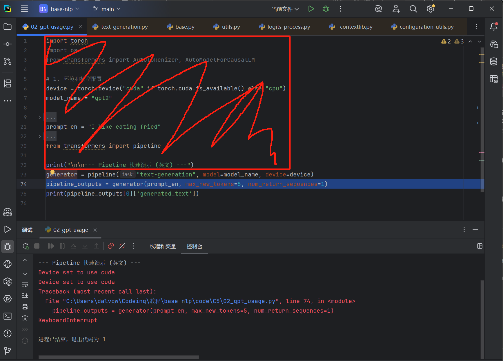
  <br />
  <em>图 6-31 化繁为简</em>
</p>

那么首先我们就在 `pipeline_outputs = generator(...)` 下个断点，看看 `generator` 是什么类型。发现这是个对象后，那我们唯二不认识的代码行就只剩一行了，第一行无非就是创建了一个对象。接着步入这段代码会来到有三只小猫注释的“魔法方法”。这里主要是一些输入格式判断和改写，我们可以直接跳到最后的 `return super().__call__(...)` 并继续步入。再次来到了一大段看起来像“框架胶水”的代码，也还是先定位到最后的 `return` 并步入。通过 `return self.run_single(...)` 步入之后我们就来到了图 6-32 所示的 `run_single()` 方法。

<p align="center">
  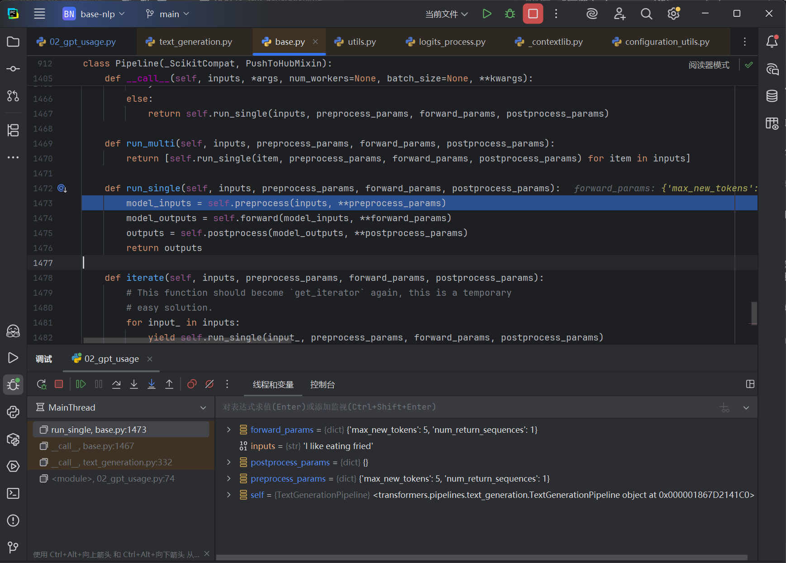
  <br />
  <em>图 6-32 run_single() 主流程</em>
</p>

虽然这里我们不知道 `run_single()` 里面这几段是干什么的，不过通过变量名还是多少能猜出来这里就是我们要找的主要流程，从模型输入（`model_inputs`）到模型输出（`outputs`），还有眼熟的 `forward`。猜不到也没关系，从 `model_inputs = self.preprocess(...)` 开始继续步入，就来到了 `preprocess()` 方法，依然是一堆看起来没什么大用的代码；继续往下走回到 `run_single()`。但是在这步结束后我们是能够看到输出，也就是 `model_inputs` 的值，如果觉得这个输出包含有用的东西，那说明 `preprocess()` 中有我们需要的代码逻辑，可以在 `model_inputs = self.preprocess(...)` 下个断点，然后重新开始调试。现在先不管这部分，步入 `forward()` 方法。如图 6-33，我们又看到了两处眼熟的 `forward`，那就步过，看程序会走哪处判断，接着继续步入 `model_outputs = self._forward(...)`。

<p align="center">
  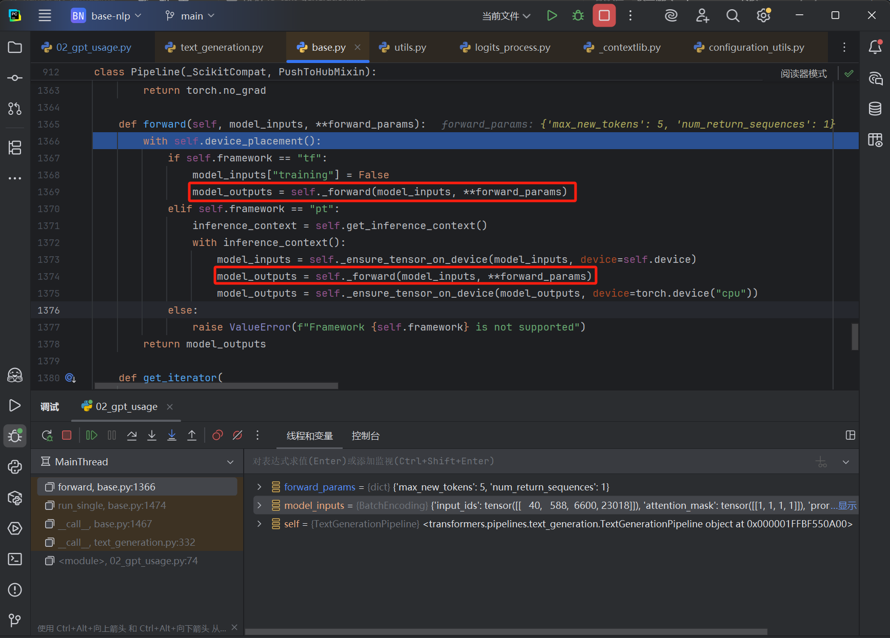
  <br />
  <em>图 6-33 forward() 方法</em>
</p>

到了 `_forward()` 方法后，继续步过。需要注意在步过的同时我们还需要关注变量窗口，看看有没有什么可能有用的变量。当我们步过 `output = self.model.generate(...)`，明显会得到一个大概率有用的 output 变量，那就在 `output = self.model.generate(...)` 这行下个断点，然后中止调试后重启调试。回到 `output = self.model.generate(...)` 后，两次步入就来到了 `generate()` 方法。在 `generate()` 中可以看到清晰的 1~9 的步骤注释，这有助于我们定位到需要分析的代码行。当然不是所有代码中都有这么清晰的注释，所以当前我们已知 `output` 的值是最后 return 来的，那就直接定位到最后的 `return result`。然后开始通过 Ctrl + B 转到定义回溯这个 `result` 是哪来的，这样就定位到了 `result = decoding_method(`，在这里下个断点。接着看 `decoding_method()` 中传入的参数，比如我想了解 `stopping_criteria=prepared_stopping_criteria` 这个参数是干嘛的，继续通过 Ctrl + B 转到定义回溯这个 `prepared_stopping_criteria` 是哪来的，然后下断点。以此类推，最后我们就回到了 `generate()` 开头的地方，这个时候需要的断点也已经都下好了。恢复程序后，顺着所下断点进行步过步入等操作后，我们就能完整分析出整个过程的数据流。

---

## 参考资料

[^1]: [arXiv:2007.14966. *Mirostat: A Neural Text Decoding Algorithm that Directly Controls Perplexity*.](https://arxiv.org/abs/2007.14966)

[^2]: [arXiv:2407.01082. *Min-p sampling*.](https://arxiv.org/abs/2407.01082)
